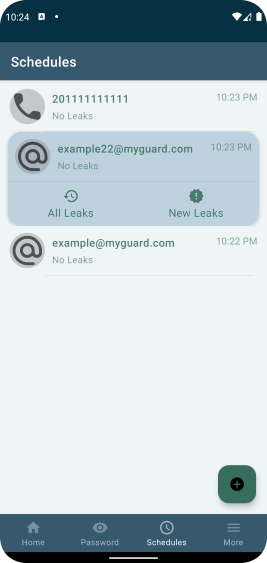
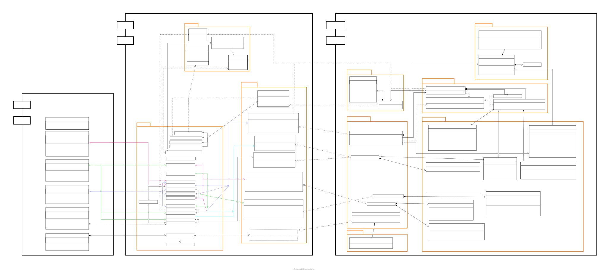

MyGuard App
===========

[MyGuard](https://play.google.com/store/apps/details?id=com.rmsr.myguard) an app that intends to
help users keep up-to-date with the world of leaks through billions of hacked websites and stolen
data that became publicly available via the internet.

The app is currently available on
the [Play Store](https://play.google.com/store/apps/details?id=com.rmsr.myguard).

# Features

# Screenshots

# Architecture

The [MyGuard](https://play.google.com/store/apps/details?id=com.rmsr.myguard) app follows the
recommended **Clean Architecture** which can be found
in [official architecture guidance](https://developer.android.com/topic/architecture).

> If more implementations details needed feel free to explore [Resources](README.md#Resources) section.

-`SVG` resource, zoom for more.

# Build

The app contains the usual `debug` and `release` build variants.

The app also uses `product flavors` to control app authentications and where needed tokens will
loaded.

The `noAuth` flavor uses static local test Api tokens to allow immediate building and testing
app [Futures](README.md#features).

The `auth` flavor makes real communications to a **_Firebase_** backend server, providing
authentication tokens, so user can use app safely.

# UI

UI components at first [MyGuard](https://play.google.com/store/apps/details?id=com.rmsr.myguard)
releases where built entirely using classic `XML Views`.

As new futures are integrated (like **Schedules** future) `Jetpack Compose` is used to build the UI.

The app has one theme till now which is `light-theme`.

May be `dark-theme` implemented in the future.

# Resources

- Database diagram can be viewed from [here](docs/app-database-diagram.svg)
- Use case diagram can be viewed from [here](docs/app-usecase-diagram.svg)
- All app diagrams can be viewed
  from [here](https://viewer.diagrams.net/?tags=%7B%7D&highlight=0000ff&edit=_blank&layers=1&nav=1&page-id=WIBez5ZPqC6xa2WDKK0G&title=myguard-app-digram.drawio#R%3Cmxfile%20pages%3D%225%22%3E%3Cdiagram%20id%3D%224lrCkOhqWDYaVESIxCga%22%20name%3D%22Database%22%3E7V1rd6I8EP41fnSPgNeP1V53291ubff2pSdCVLZIfCFutb%2F%2BTbgoJjFGRUuBtudUQggh8yQz80wYK0ZvMr%2FywHR8hyzoVPSaNa8Y5xVd1wxDJ%2F9oySIsabS0sGDk2VZYVFsV9O03GF0Zl85sC%2FpRWViEEXKwPV0vNJHrQhOvlQHPQ6%2Fr1YbIsdYKpmAEuYK%2BCRy%2B9Kdt4XFYqncS5dfQHo3jO9eifg%2BA%2BTLy0MyNblfRDdikv%2BHpCYibiur7Y2Ch10SRcVExeh5COPw0mfegQ4c2HrXP3qjfapg%2Fb%2Ba9X1rvvzPUr%2F2oho1d7nLJ8kE86GLVptHgLx1sveaAARF4cFXXg8AcE1kF7Z2jCbDd8Ixvhb%2Fhmbg3t2jwrX9lwbufv9udRfdSh1eLqmYsn33ZfR8vYmn4r%2FbEAS456ppj27FuwQLNaK99TMY7PuqOkWe%2FIRcD2jWNFJDTHo7AZdTWavTplaSYlgbyglZ00ZCcj67RGvFx1JewUQ%2B9LFGh0%2BuhT%2Brfx0NZWxbdAh%2FHV8WCpmct4I%2BD%2B9ED4NgjOmImuRp6pEBRMpEE%2F0EPw3kCtdEoXkE0gdhbkCrR2aYWoTCak80YtK8JhMdl4wS69XpUCKJZNVq2vbzdAwEGcEdklJb3a8SXxWsAf7u24G4GczPgkGFxAYZdKiY%2FiUfyIfGgq6IAQfFhBFrx3BCiMZ79%2F4Azg%2FE81hlIjsGUfsRgQIvWoEalalKU2S4VaCB%2FEzkOmPr2YImjdSQH7SyRPLTn0HoIVzEtQOjrLWnMjxpPQlIIIR5%2BAWh7yEG0Qy4K5tLQdhy2KAF%2BQ4hFyfxVAuNiXcrbsMeiIQm9NRisZK4oZF1dyOT5sQ2cFcZZeQaT2kPTR%2BCNYLwGTJFNxXHxj4zdUnL8kGM0jU46cBhfO0AYo0ks%2FWg4lo0GY9Hokj8yOr3ap0alQbrbI8fa6pj80eoe7iGXiJ%2BAkbYBCSZeoY%2F3l7WuvvC8n3ANTrj3X3YTb2BXgJV4d5ZcjZEcq0cQGcChE%2BiEsW1Z0D1AJPo%2BIjF2lIhgpd%2BxtYOWckXJ1znJDwIL5fmGXHZGztyQoXxfJMTLdVi360%2BBabuj2%2FDKJgOVxrtBZb5xpdZaqUJHqbl0sfN18Xx%2B82CBXrv17Rpd%2F7HNi9cqD51S7aes9psnVPtCGTdKrb9N1NK5kQ2lL%2BxiM686XwrkQql84Ui0OLm7YAJDZd%2FHHlGtxdD3B8IkR%2BpexFNV9C7lCylXZZ3hEB23iGKDrBuGVguGlFZx0AjdBzxdEkBMJWxjB0prWNA3PXuKbeTK60WMmaRKaMCek8GQVpu%2Buj0yWNGz0YWfuxfAoOcA36d0XS0aA9unFR2KzGXDI7xEWJLRqygwefUEAHgmj50KivbJ%2BpSpC6YDBbhtAucsukEwQ0ODKDGVPYRBcmrT%2BR8tzUczeTqKJo%2FW2F0x7kVv1TvbbSBojWC8IpEBsfHiATqAgvlidYYTwhhPYuoVutYZ5eHJ4cXDG%2FTQI7oD7iI2mVfnJsC1vgVC5iUg4z19NPPMuLeNton%2Ffn2a%2FBm1qm%2FO88UZ7FWjh8KxcUbtAe%2Fuon477L%2BMJ3eXb1e%2FYPV6UDUiu4E%2Bsqoe1YQCjAu9YKj%2BJVuTrpP3KJis8QqsNdZ52pbGACN89OiqJPHPNKQzDTXZhsKx4RraQzELR1bnje0%2BXX5ngUbom8Al%2F4iSQJ7Fa%2BiS8k%2BB8jeMdQTUdcXFSGehokj5x4R%2BzPLWBffTTm42iuf9Dq5g4dx9%2BXzOJMsvXdxLf39HWRt7%2BZcnFi7v%2BeXE45djuVAuv3go2pzk%2FciyeLaLxvMfCpYcOf6K6Cnj%2B0fX%2FKck%2BsVC1kvNv9%2FKka34vriPuY3vy7Fcan5jY3y%2F1Ps7QiXPev%2B3fv3yt93T648t79qdnT%2FVWq%2Blx38Cva%2FKdqehGsRCLj3%2BrbKWz45s6H1xH3mP%2FzIfel%2BO5ULpffFQCDx%2B6Ps2ctcUv3FZDN1%2FKFzyrPvFmkykFmhMfOZD79lF2B7aMAJSFyEH0uAUEz4Pa5lBGPTRnkCuQtAWMF9c9OqE4URZc4mKYWsMcD9SrDwl60FTjU91UtAwwqhxjYNJHLL0%2BZWlUDFK4JnJ%2B%2FMYSCdkycSsNVUiSZO9pHQQJEq2cLMeks6hTIYJZXtFSp9hR0lniyoUdjG3TKEUyIVyGIQjwfOExY0QHgiVPDsLc63z1X%2Bc%2Fr2%2FqvXPP99XX34Ct6qVKv%2FYKv%2BU8UGxjEudv1XU8smRDaUv7iOv9XPCE8qxXCi1Lx4KXu%2F%2FN4PeonhK%2F1Ck5FnrC3WY6LUIytPZ%2Ft0Mb%2BMGTQ%2BSzm1%2Bsyjx8QPTfOnoftUY4R4vxKgFE3jzLnoZoR%2BGFEqqb0n1dU5H9annIzoaMHawCQtn90tnUiapPnGQrDT795L0XibmaUXLm345ofqkQC6UzS8cCX5bl2hrQCGM%2FgORkmebXzg0m3YFbDPnuwGWCHK21IHUrJPWAFP7ARIX1cd%2BP3gzWrHyhStv14vqnf0bBbsLtrol8QaGB%2BhPkcu6Ox%2FYaUnHcFGOQ6exNUGs3njT5dr2MQp6GaZhJR9%2BPcBhwd2XY%2FkrbALVuujt5mPtVhFDokxZtqMurB8tU2nzaEJWyNdRuiyy2ZFhnyWmMgritCyxXHotDZ6FLGik4lCkFM5rqZdZLBlQCa2G9NVEVkjMem5zXcrxXmqNOv8G1Cq%2FdYG1RSHzXCoaGjxk%2BhB4AVuwJBBKwuAEhIH6ywxN%2FXDNIcwHy79Gt3HVKAmDtdmTSetAKOOSL9gvV3JbWdLvJlpNTBeQxmo52eAoRfROkmmkqs1VWjtBsnPB1vSCsgYHAmW%2BLtak3ZYucJSaO0Woc1Os0w%2BMwe8URdL84gHOHhcUSbTWhTubbNoGuYo4OsIU62SpPjNN6Ptbq4KgmiSved4Ck7vbG8pGZS0Fo1KYUVxAYnOC%2BVgZxaW5lZIpxaVfsrQ1pXgk33a7%2BamW%2BNHXvIZOo%2FOp02kuf1r8iiVNR66eebzZZPwVLpitmnq8WWNymLNbNtNLPf5lNOr%2Bbj5d3%2FdbV932Z%2Fz8Al5Er%2FGHW4Lo8rbKQV4Gy0%2B1uTeVWLlA0WY78bgQm%2BXLhZuNOulkzmTIXthjXV3ERfXApVMjGx64sIu5zScgBXKhAi%2FCkSjzCaQGlTxHYMTLmoJ%2FVCx9oBivP1BJvAMhL%2B4xb%2FLdv%2BRXaWjqBlvetYYgy0Rh3005FCt5Vht%2F7PHo2RsuOo8vP%2FDlGHz%2F0WupOIq7s2r6wazaOoHBy1mVY5NSZ0mOTbrjIzNf21dnyLMlJbErd9ZgGqqzDaXHnQlhp%2BC8fmTYyeJG21HXyRjqGgzRqtXSomw7bENHhp1C3vbTwS48JwIedAZBnTgedBAWZa9rbsVi5r641GDDBzU2BKGKRXYt7bANpYdFYZoc3l%2Bj4VG78DmAd0P6%2Ft9TusNGuRR8NnGmpO3LUWFZeumcyaRbLuxxydLvmURMWdLvJtrcsvRSIBeKbxGORJn9Lx2c5JlrEQ6N6I26ICPGLIbO09PNOb%2FfjQgCxlvTNuybw%2FItc2ObuZ5%2Bh00%2BNrilYyeo7287mi24q29KfcQsbmuTJQJP%2BpuyAF%2BG3M3KGk3GbjFTdTY1hvhoKvJtRDRgkagWGWYb%2B6uv38aIcL0CZthgqsuaxr%2F79TGRq8qUSIMMGYLuOhba%2B5J2ddZxXn6D0nHB2%2BikC97reuP7w33ra%2Ft8%2Frle9fVfbfNJwMJw2N2N6wtBqMgwq5GNqdKBMqMtCXJpaufsgJzZAmrsDXKmIW6PaHpsoBCHCilDi4lDWSglMzBkw2nGvnZCvc00lFpcjhx6COFkdQ9Mx3fIgrTG%2Fw%3D%3D%3C%2Fdiagram%3E%3Cdiagram%20id%3D%22V2pjxPVCgDuZ4CxXui-R%22%20name%3D%22Usecase%20Diagram%22%3E7VnLcpswFP0aL53hDVk6dpN22mbcuJ203clwDWoE8ggR2%2Fn6SkaAQSR9TEOcjscLpKMH4px7rmQY2dN0e8XQOvlIIyAjy4i2I3s2sizTNXxxkciuRHzHLIGY4aiEjAZY4AdQIyu0wBHkCishTinheN0GQ5plEPIWhhijm3a3FSVRC1ijGDRgESKio7c44kmJekYDvwUcJ%2BrGrsKXKLyLGS0ydbORZYMnf2VziqqJVP88QRHdHED2m5E9ZZTyspRup0AksW3OLh9prRfNIOO%2FM2D5%2FevqU%2FQexXMD7OvZ9S66zcZuOcs9IoUi4%2BPuqkAsEuBkvVYr57uKqv3zgpzRHNkXmwRzWKxRKFs3IjgElvCUqGbEQiW2L2r3wDgWpE8IjjOBcSq7r2jGVSfTq%2BrqfnJUQhl%2BEBiqJs3F7XAWi5rV1D7LuWZGA1xQzmmqsBUmZEoJZaKe0UxMfaGTp%2FiUq4TtAaTIvAKaAmc70UW1iggph1RRb5XVTRNCbhVDyUH8eFXYIxW2cT11o54oKAH%2FQExLE%2FNLDkzTUATiWhaLlExCLlmptfmAlkDmNMccU6nRUtH4iHgHWh%2Fq6PRzfihtT%2FT%2BsQDnQYt%2Fy3E1Afwe%2Fk3nufg3NaohEolGVRULjYNkaFLGExrTTFBP9zEsufwBnO8UmajgtM00bDH%2FqobL8jdZPnNVbbY9aJrtKgd01IEsmsjE2SxLIJdYPu6%2B%2F6Pq5LRgITzBgV32kw%2F%2BpIYMCOL4vp2B%2BxRRQ%2BcUi6XU2ptB23y1%2B6opOGIxcDWqo2u9jL%2BX2tastgCR7hKZNsNQSCzX%2BgHQXa7HBCFiY4Nfp88XsJTlt2k1bT2pWYZ35vbY6tnSmqdxvd%2BZjFvK7oDpBP8v%2BS1w2mLYli7GwAnOP2W4sf9CGe7cHzTD%2BY9nuDnK8w3dnxFfYYrr8hocQYozg5OxxsHLGKtOqwMZK9CNFSYQFUJp6%2FJLltcVjwgCL5biAO%2FFfM%2Bsh1JpoGyZy4s6aDxlvyes1ufMIezntdl3nCOwnzOo%2B8yjdN%2F5MO4L7I77nGHdd665b8oAcWE3YxGiTF4gz8XpMJcbHTBMI3kuJLtXtcm5naOj2XN0HH6TO9lMkGAM5LPO2ynbG9Zn1XP2nR%2Br%2FS76J3vcMbrPbx8xPf8I3Oee3Dc2zRdyXzCw%2B6qYbdx3A2H5l03tb6J0A3lBXpu3Osw6xjHsbN7JW2NzoFe%2F3RNkHQFDeUt%2F9ztnkAu%2BEC99NSUY9ivW97d32YqyVO58PY2TFZefaxqHviZfdlRxn%2Fd%2Fnag2X05LZZtv0%2Fabnw%3D%3D%3C%2Fdiagram%3E%3Cdiagram%20id%3D%22WIBez5ZPqC6xa2WDKK0G%22%20name%3D%22Architecture%22%3E7V1rd5pKF%2F41XW%2FOB10Mdz7mZmKatGlM2qZfsoiikqgYIBf769%2FhMgrDBgcExZRknZ6IMAPMvjx7z758EY6nH2e2Ph9fWQNj8oXnBh9fhJMvPC9qAof%2F5x1ZBEd4UVGDIyPbHATH0OpAz%2FxrhAfDC0ev5sBwYie6ljVxzXn8YN%2BazYy%2BGzum27b1Hp4WDje0JvFZ5%2FrIiJ3hHej19YmROO2XOXDH4VHERU4%2FN8zROJxalcIvHvX%2B88i2XmfhfF94wZC93%2BDrqU7GCs93xvrAeo8cEk6%2FCMe2ZbnBX9OPY2PivVzy2nrXk7Mu17v9Y%2F4WBmOVP7y6UVvBYJ08lyyf0DZmbuGh3%2Bejs%2B6p%2B%2F4xnXEXZ0cnp6Pr4xYSg7Hf9Mlr%2BD6vbcPB8%2Biuac3CB3cX5GXjdzD3%2Fpxag1fv2JE%2BMUczfGBiDPGtHTlzvW%2FORpf%2BpxP8mlZn9PGgho0PvBm2a%2BL1Owy%2FcK25dyV5u941jmtbz8vllPCRka0PTDzCiWljIvJuTTjxDukT%2FOXQmrm98CYR%2BRwQqoiX6ejJcN0FGQ0JEjm0JAtZwIcY33K4Gt5TGB8REgzf%2BplhTQ3XXuBTwm9bSCIkF%2FJYSww%2Fv68IViX8NI7QKhII8ekhl4yWw6%2BWGv8Rrja88p3Z%2FeLH9cV5z7RvOfT0Tf1%2BoYTEEl34E2uqm82Sl7LkCqJWXNaSS44kDVpzTSlhzSdnx1dfXxY3N9Ldj9Hg59%2FuxSVq8UJi0V8do687Ruqqe%2BLYX0L6hbv64%2FL1Ii44sHy5Qnjg2nLMcOVCahm700k4wqMneo3B5SM5MNEfjUl3dm7o%2FpT%2BMaw1XEyVkc%2BTiT53zEf%2FRrxpMHG82o75ZtwYTkAAK3I6tiaW7T%2BQ0OmoHOd9MzQnE3J8YAz114kbITbyzcyaGTSJrifIYH6kJui5UmKjxQvPJWlN4SBS48QSSA1ULFKC0lJJ7F1fzC1z5suSZ8Ptj8PX7S0UoTjHmnjTHYUrLOM%2F%2FWsM%2B%2FQNv04npA7%2FmP8o0tEX6YRa7XBNbY9O9AgBWVjZRT7PDdvEL8EnuUCCXa%2BOHDkzfX5rXQc37E8KkBrHqRy44tlsybzkihRbcFESEgsuAutd2WqrzWpXuNoS0mLLLQP8XdVyPz3K1z339f3Kla61ztXoaao9ANghsdzGbHDogXv8yZobs7jkx18SUcn7r1S3XXI2FqdTaza4HZsz8hU5VyQHOqZ3vydRqBGqFxpoPFqua039ZfeVTXiVMcAmRHizlu2OrZE10yenq6M5hbVjvdr98Mnnv0XdPP1Q3o%2BF506n9%2FNcHU9bhEHx3Y8MN%2BNEPlxq7w6ZhD%2FXVilpIIfLYxsTDOLf4mYSRAvh4AGVR9VKnOywmhfbmqZxCq%2BKiqzy8RGDdxAOErVD6HHxMPS4UlvmkMIjVRIFTpTiAwfvjGXg%2BHXWcOgYsUswjemLyBmhAEl%2FBaIUf7WIQxLFPcGYK15aLhGbNO23Hp33w0ek%2Ffz%2B%2FWjR6V70ZpBRVh5%2FEWBTDWM9vU7nhLF0u0%2BOBPOoTJyXELAcd3zMwQKWlSdBpcXKkpJaG5ZUKaQnS2Ib8aKIJFVV8JcU57CzpCa2ZYVDvKwqIq9oXPz2NVWuDUuqYvwVaMI2ODJpODUcuTuOFOujJDU%2BTo6Yfdoyj3lIESVZFpWiSpLXtDbSVj9q%2FO75GjOkqpXKkIJt%2F5z10U%2Ft7qYz6Bvns1uTB8zLE4zqEzy5Vd9V0qmQ9Gnlcj6U6ACThO06wDSNwf%2B1clSU7%2F%2BSfwiHd39%2Fn6rj7sOZ059ftdwJYKbaxtxzUVnh4IU9YBrtARPr7AFbkQqfdL1WSRYIyXG6QBJgykJeUQ2VQBS33Zk5e%2FrO3xqX04c%2Fh52X9yus25PWbK%2Bvz26MvmUPbpb00Z3OJ0kaeTenE91nVpo6GOVIf2xOBpf6wnr1HhSr%2FP4z%2BXQ0tmzzr7f6hDyiEIGXY2f0vCuX9OCRwTVZPUQdutI%2FYide6o4bHojTlnfhFCsWc3YUYouAsAKh6d3D6lPsjKgvVAbJKZM9aXLy9g79%2BzIGLETGU753WZCTokcCaIxWqoD6x1Th6rMRfj2r6ShRJ6PkdAgiaUGMT6dPMKHMdNc48sSCkyDsfGoTpnV%2BPY6dmDMjIRQQ7FxbA0mn5mAQIMiASG49kj9poYTmFVZHbsgWAuCr88VjRKLawbmAI3COkeyxNcMPoQeuOwMT%2BbvhuEz0m6TXbMmxXv4t4hS2jjTUimQdIOoMx8Evs5Fz%2ByfnkCzETQ%2FALcwLpck5CuarKrChKddDzDVSrkQpV4qQgwijBCHnvjz8kefuw8K6uLuwX4ac1P8AVr%2FXHxueAVhfKedvmDdSDpByQlzsCEhtS1WKObb5oGAdgSLocgUdSOoMGwWNoAMINlNuMAs6AdC3EGGUIOhGtvlxNx%2B9PJze%2FXx66LcujZvHpfkdid3THee9MVvrIehSRRqFpBSykxqhIwG0CsR0QkoXaGSDZLWHCfhckMogQMsVaCBJJwVaC38cGe657owvDf3ZOcZzuweYBNzvQ%2B%2FgF%2BEQn9FzbW9t%2BWPvEfDR3utwaH54Ycmrb%2F8LPnQ97zV%2BMsGPWvOGd%2BYT0yWs4415ELvgWjdtfIXvqY3OQ%2F6WR%2B6SWCJMholh5QOmBG1%2B2Rt6nWNiVkyKWe%2BQha8dTnzn9BhLbH8rKhH1EhOxR3jxjzms57CwxY8mHaHV50rkb6Y42wRognwjleA6BO%2BYYVewUb%2BVLb%2FCuPwlqF%2FY%2B50UVlg16f1xo33rrH2pDVuElAQZiZA5gVAh9btSt2RCHlC%2FytbVL0zSciPRCkm0bAGxiUYDabEykaak4a9AshnO0eJ0qpuT7%2Fb1GC9xHChd6YtHgyClS9Nxyd%2FBxacz13QXK7y0%2FH8Ui0Wm6g6KzXZpRVEZOItj6HZ%2F3LFsMtc3fVrw2WgUCM%2Bnvxm31jm%2BDCuFg%2F%2BAb%2FHDxk5owOS2eY%2F4qdfyXlXRCUnem9vG0MAP2jecJIrIEZ7Ac4nwhPCMJjwhMzyhhbk0SRXgLocgtkVlc8qA9zOS4U49w3Uxazh1Q5gC%2BnQIU8lLRjxFRbyUdPCA276ylE5AGQ4eCmAKkH9n%2BwATpuSkkGsAZuGtuaVcYFdySXG21QAEHjIwjr4c818OOdPpzvrWaIYt59OZ99IHByH4OrKsiaEnU5MbVEQIJiGTq6MgjY2CsnbfWEnoYfJ48usUTc4O%2B%2BKP%2BaMt%2F7o%2BAmNYAl14aeHV9OKAe0GgeZ3U4ufb382vFuNqSgK2VXmIkLIiPzP8LvQ2S03UovtiD%2F5cvEzVH%2FZ162py8%2F14cQ%2Fs5LUCmRi1AIKtjDFel8F1hmEACsVVrPm%2FJReTICKGBHiK%2FGHjIlMMbbRbDNG7UIJ9Cd5xksg81eu7XEiAjONFPnc9EfjmSdKFA22ZBVc5GVcd4A%2F%2FJa7A86xV8MlJEpeE54Ljf599M979bcLvs8nim%2BWaw8XaGaCLMmfpmLbjHs7nN68zhgeInw29FGf5ItlfS%2BKS1Q03IIkZVZfD2TIjZ6MyNiLBW2aov7CNhHy0nn5SshSjQti%2FobVJicbk0b89MkFu4BLNRszExtF0xCyCYc1GRDFYQspBbJytr7U1TRGQJqmKzKuKRkV98Bo1JmsqIi%2B1FSUYVJUlTVFVamCecnutzUUsL%2FmQzr1ACqJ4abPcQ5B%2Bks64gSfTdMdojwMH%2FkNfx5aCtyuwidNWTjhthX122gK6JsmwJflxFSXOZC0EyGjEgeZGGf597fb8%2FXd3ohuL%2B3fj9pyzFeEJCtb0MP6RX9hmqGNZhD8eRbeOwv2g44CaeljrucYIyFTcnV0r1dmuzVXoK3yHHfCigiYyu3MFDj5GErAnBZmsWjETWabqPCCoSB00H11ZqFwTGeQeqKBY6Dgcvs6CPzyxa%2Fx4NezFL9Mdd7x7IRu8B%2F5hsgXthe%2BlbRmH2PvYms4nRoBVG0jNZl9HvOh57OtMacmMwqFMYhbaLU2%2B8wkKheV3R%2B%2FDCec7dE%2BKjRivTozLSU%2BnAEEPuWCAGZXvzGyPVpuZB%2FIIFDHreTSGtjX1alMfhCzj%2Ff3fFw9JHgainREKNZK5esnMM7NDemQNSP9leD5B93pSMt8BJW%2BTHhLKLTLQnbHvsUBxkytvbUHjw3R%2Fe9e2OU4OP997V7cVTQw%2FnxCx6n9YRD5EylOmeLWyhFjU65HFoVGnR5Z%2BXuv0gLJANy6DFhd4otDWEFJkrO4lVcUf4wOy11yihlW89VgOrFB74ilujrwuDIF6GBQ6hMpyYfz9e88557O%2Fv%2B5H5tcn87RvfhOAULNQvobe5Dqamp8wdj03sJBoYlEA0AuJ1mKpY0hCcQORBwrX72APFaRpBh94E1kEUGamgNgoch0kxM1VPHjDWmL1V3HXPT%2FamwRXRxwBoanfMwOyB8PH6UDtcBjPwUB8Cze%2BOsNLchBc23gXKtuwK4dYoVBviFjL2K8DAWmV5URrul9XMkzlkzA1izZY9%2Ba4NieTCDeydyCVhFoFua0gbvVDypItY82pfTRW3OoNiziJlwUkKaqsUcMiYXf7cyr1LkP4Uim2Ber5ZTFXKEVjth3%2BOlJ3l2K2VMMvwRMz%2FCCence1NU0mB0JDb3XGytLzPy2in2hbr0o2y2KfKJud%2FLasn%2BL9nx%2Fm9aOkn78Oe4%2BPzFvgVViDvMa3FREbaaqqCLygkU2TZT2%2BovagV%2FuF01RJQ5Ko8ZpE1duSJGrgkizCRDuXsGpf2n3S5yNFrJ7LkpuZITA6MZ3qTMgl6m6syPVWZM5CSwnbEgpYLK%2FOEst0YDp%2FtV5rkNgZmhk1piUrWi8jKbqqOg8woIACZ9MBxePE8kRKFYiiuHLPUtq1dvXyarZy5wsrdy5buctsyr2sDAAGEfPZLMIIPpZi6HgNMi7OBRtZkqxcsAVLkl9jSaKCliRaZ0ruMNRTVuJ4QSvXlMwSkP9CW7sNsWY6qmQJaasoSgdcUz6XoK3QOxBuAmPhJ%2FBfopvAMpd%2FE7hKxwArdthIalaAHTSktGUNmyyK%2F69KxTrSFMYqJFW6hQVHGSQVuQEos379%2BeJGEvLOMezvj09ex3ae802IYNhlrPtAt4L5sOnzvPrui3Dod2znO5gN%2BWNxYh8%2Ffx%2B%2F%2FDq513%2Be9rofx6OwTU9mjL0YeS8hVxdtzaJqX6jmxNKXJoyeRXYnwuiRJAHFkJEAti7nNLGdUc8iRYjjjxHKg%2BX6oTSZvfzq3s1E7tvtxfkPRVFvAV0dOqSCXbrfN8bwhFDsem%2BUwOKN%2BodywtPCLWPkybOrGXYnAJG6XFy6CbIIkKIItXVJSHrGvi4clVwkcMkuy2DwAx3HVq6HCqR%2BKIEcP4ltDL1E0ake7DonOKLdOz4%2FvTpMcEWzBQ0xAkzfmdJok%2BxwkJjLiJEE75gBFzc%2Bzq2RAxDCDZJDCT5P8IbT4rTNGVbObkyOYDFyEI12SQiZrNAXKrE9ZfgwrbI7CEZYRdk8%2BqdEjzNM4lUT9wc0Dce7Pycc3%2FRLToZDZYfvxKpBXunz%2BKlZ8T8ZhSKXd0fiioKbe1yVw9z6vTVqgVEORLEjX5lQUNmEAt10tohUuDeQq46uvwrG4dU3xe1%2FTO6uAYwdkGoDrPcYWFN%2BVTlZDluAm0MUyzkVqLJMLWjjF0GNYauF1SDBw7A6kMhRYB0tcNwOv2iEZ3EQlSl9NsHUKaRckbxsMHWdyEEC4gggcigBU4M3nI2pD9YVTGdAtgMDf2McYaB8wIiFyRVe%2FfN4wfM1CDq4Q3qqGPZMqfqeCne9wZyDPOi2QI15YFa%2F9vtBek33qmb269tvOvmaYvekXpiXAEGW7MSaYjYtt3R%2Fcp7uIOdMhZ8kSbtVPk2O2ZieCBPE4WSyLFNR6hNYj1iyvBn04B0MBkK%2Bzjl%2BA2nKsQfLUWhycisdVGhIKwHgDHmBv5gKlwv09btmHNsnPyc3UC3evj7DsN%2ByB41RuL9GoUSlQsscuNsCBW7wXEG7kKpioQHdrBEpybc9sxAke9gstH2yD1MKw%2FKcK3YgxmG44RLLKwwMSsiUhM52wrHjM2Vd8eKlPAanR7IfU0YPGsKTwfVZ2CGeuqbRBIWtmUxJutGGEcSPZZSzA%2B%2B4MW7rRA4IsdJDReSQw7pNE445LN3X%2BQBL%2BLJH9SphB9IuGMBJtW3zTJwF%2FVed6bcwX2gOLEtHLyfNNrmzzAX2e2kURjmmQ1niAthLAsVFCXtJLakn%2F2hJ11c%2FvkqHz4s%2Fi98qD5oOAS01hsP%2BGg5UtLcgq8x2Q1axhRx2wzJxJ2o3QAGK1doNIM3DdoOPzqO7STGMHm4mgRZA9CLaDmg2oTYFZpliq3ScXkbCA3jHDU6vEzlABbsqgungDa%2BB6XEpkqc%2BUgyXg8Os34cqfB3jbtfQnA1%2BEGnrzZOxe5X5mBHknjpA%2FFlYhiq%2B%2BZU61%2Fo5jxZXr66BUQ1%2BjcseMlXN5lXN8hdg7Vtbnsn0EORss4R3CM3MZk9F7yKH7ZQxYaO9yzGaSpLdjDYTKiMAz7ns%2FX2ePj%2Fd3T%2F3utfjS%2F7GBI2mwF9BaKlJc9lv%2B0mKJymqObJchIxNviz7SYlPqZDNwqj9BO0qVms%2FgeTPkuXiVwsHuKLZudgcAmfKpNJTXcoIywPvuLGI6kQOQFheVaku4A1nW0SUJKGTXQBBk2O%2FIXWKcBM2mfDiLA2XvCkv4SxhUkk4QU0SXpYIOrw58rFJeamxelgDucsRDkCIU2UpL9Mfk1v18mz4JqLzcc%2F6273%2FcZcS4USYqYHanwZqywoEtQUZgtpyRl2DDKidiKoCnIFI2nqIE0j3MNR2VqoqirabKKHywVWmNNooBQYiaT5%2FpQ42Omqwdp3IQWKUcCVgbfCG1%2B4%2BUIJkgw0IeCQ2kJzhnaaGzUS1IUjYwCOdPlvqrJ7mJo%2Bx2SPok0kU66xNTWC43UYflAOuy5EGQKQEjHe4EtD1B%2BofXX%2Fc399owmh20js5fzFHALr2N0IaWL2%2FsFrU4kVPBT65a8JDVZNQwR5VdAM1CSjTBNYRrxRUg%2BS%2BQfxPIzkLQ6dMybMJkgbJuAyvNXjHDZKuEzkAXmuQHEpA0uANZyPp7%2FaZ4WZ1OtOnHsdHEWlwhOA1%2F5tHe4XcVtj6cDbAg3cHGw9vRvBhYj5hZRVsOo9XijRrqsTdCCs7Ijl33IIA3xNG4f51%2BB3d3XVPKNxc6NWTIdcMGGtyn2tcwOLJM278HTfKqgDM90HmqgBtVYIL8KjDcIznNhddN1bH%2FPH8YC7Ou7Zivnx%2FvucMMIgl0qCxAf%2F7C%2F6pEtQynzQwISjOowxay4D%2BKjXf0sEedahDEVrVYn%2BQ6mHsH1Y2TISvRPihcamXhfwypdFGLnWQqEswBMA7bgyBOpEDVFWqou5U4A2zGAIRcFfcAgBhMnHcJwVWKRaHOevbxhSvWDj0Yb9vOM6BmYiL0f0vbs2psSYuJsOwyXgKhjH6E3w16TGd8fBdr2cDIzQnw2WDc%2BC22WbQJxPqhiEbJfDw55yP7fmCkXxIBQTMZ98EqZKVe94wap96ctZ5I%2B2%2FScz%2B2jtojKPqjaNyhDlUUQkS5kgsQbmDkDup3LEAtFwP9f4P33uH%2F1%2FSOMrTDUXkvlDdUMIDTTeUNbbNqrIRqVwrAzU3JIhcxKxauazkctZZHMqLq9%2FX7yL%2F9DRUjl6Ery0eUv%2BB1MEsNosRivzyarnhW229h7fnyT6FCzZ9yQkRnR%2BRfPFPmM2HJhYarolt4qBZFJskDG4rRRhGSC5OFQNjqL9OXHB5M%2FmIPXOd7vZBGk7FgrMYbMkiazuyzY%2B7%2Bejl4fTu59NDv3Vp3Dy2EAD0PfPwyG8ZN9TxK8cfj6Ib96TS340vM06wLCdrw%2BZQYWrCvKFDRaqzQyUiTlYkl%2BZWCd9hB7woqs2kKumWrtSWFElge6aC5RYkLR42KSXn46Hi3XR6e7keF5h%2F0kyjWPVXbFLgO8CG0vUYL%2BsBwZXHgScGnx1PiqVCkRKVM7Fmm2MEZLCE6kTqfnZsa3o4NxOGQzmzeOYLnsB0jIEnE44nuuOsclTTJ4uXos2aJKu2bJkPQ%2BZJVmGNz5I2cgO%2BUyRfElrF%2FD1LPB5KNAGUaNlqjN2lwirDskpNsqre2%2B7MnD1952%2BNy%2BnDn8POy%2FvVrIXkhOggFBVXrPhit6P3MQquk4rl5fqq2C3pQUgRgmFAqGgfC8oaQEC9Up4lrbFcTei%2BPPyR5%2B7Dwrq4u7BfhpzU%2FwB8hN7ew6tj2Iev7tgD8X08f%2BhUC%2FXdl3jJIRdLh5njkTsG%2FJgwMk82HY9DbowhJqJx4tRGBjOzRrZwYhaoPBCsAvGClBGBt5k8VQAo1uxZbI0AVEZhWMImBXzHajoUj8DedPM1kThrut3hN8s9yIzrbwUg3g4EkTce00U8uYIunJ%2BWPdBItK0TNBBUDBF0GXmhsOMtiRATdBDpI2%2FN%2FcWI%2BLeovvE%2BfCNnD0x9as0Gt2NzRiE7JJIDYQt6tJ6AHsMVWdOQPh8wizaIz1zTaIf4TBfm2hbxIWEQzy3x0wWfNuwV31KpMpIKDQtZ28O3JCoeXeGltirziihxmsoJGkWRKd3iS3OCkBiehk7Z6TTTjmWmU66tCaRkVEgLYjnEKssUialaW9MUjZM1RVZECsUxU65MmTSKhtoIiUiVOVGWEKJyRFModzUuOdEaDh1jU%2BoGFzkZSrjaLeNL2C0jm2OfZLcsyTrlbI0hJNPGMIA4RdD8Vkrw4YD8Cpgca3ZPrnXHefcqojfbJ7XaPpHZpT77jj%2FZ1aWrRyfIVoCcOFpBpxE1HRbXSRwLuTp3sH2SYbKd68649zocmh%2FYNhqatuNKY3zoeKzbYcGeDNc8vanQGE8p3FSdS15h5pJ0jzzIFmUUsf52%2FvXn6fsvqfej178d9SXl1oI6T7%2B65mQz5Y72VLkjdavKvUUrdzjuRQDIQcgSk6z0MDk7vvr6sri5ke5%2BjAY%2F%2F3YvLlGLT4bT28bcWzcrHL08zCfuB1mkYD7%2FPo4wqjHsLQVK0TsjYIdvkF5WzRxK90ASszcHHOwZroulrdOgvxqiv2ypwG65CEKMVmUliccIJiyh2i7tG8I2dmI%2BMMisWvwHc0xqZoHzffbNeL809Gf812RxOvMQUuqGYNhMl9R09KrEdD3mePMInDQZXB6JX%2Be7701nWR%2BSYarwko6HSg%2Fn85vXWbP9uEW8mS18NwGcIB%2BW0d0QvGUBon4W0okIsX%2BKeiojBQg9gLRQQkg%2BCIDyIwcSK5QOSBsEsUk%2BcyZ2qAwrEJojulviE3QpgmFqxSKMRDG%2B0YXEZPE%2BMLm5WqwAsoiUAhUcP8GrY9k%2BWAgT7MK8KS9tL8ymurIGBlvj%2B7UxovEZu4MyJu0Ockbzri2Vx%2FgwkYDX7uCA3Aw0eGLAlIG8iOcu1fKTfsiyb57M2cVkGOuFk6MUYtqcDZhjVseZum0TYAYLvcos%2Bfz7OqvK%2Bq5tGp5vZc5cYqRRyXVWyYij9teFZFyQAHqasqrbZNjvStxdIABtdBFUTWcH9nva%2Fg3dtSxPqzJGPZgYe23TNZaBlx33Vt37sjrIsQzloYPEvbBrwvS7b%2FTSZmZiKTtUEOOXEW7gTD6mz2fIeTs5PPzaFe5eHvs3wA4Vq1r6ZZtuo5M%2BjU7S4ipJUoCaAmDXwGIqSaZqYIlA4ssOXMogjyQ37cLaKRjdu8Y3430l4ldGG0PldmNgJrUDc%2FfYdL2S2bvJidwjuXIA3DiVmLh0WjeaIq%2BmyJS7G2kKiB%2FL0BRgNlYBTRFU1W8civ%2FCliSVyKhA7RLBgp3F3Ix0LLEEhMDtQH%2BAnJOmP7x0IF97LBtQwLntvWVbvez2IWSQ8P8M2sDR34xlHz99NjMGURNjOavnfmSxOBjblCxHBu2g4MtMMwjqUJJ4SWutoMRExZuT0EM12jFFshXYrH0fYzujN9f9dIh3W%2FcefuSVgiBDjvWB%2F4T%2Bh2fD7Y9TVXGmYtvImQiKtjKciScc6qk2h05O7mT99Pzh%2Buh%2BWMhq07Ei7lv2oFHH%2F4I6Jjk7JGIbalcLtccuWGBHospQKVCPwO17GEHmyTbnVoxC6Zfl8RxKL9TLZQ5J%2B0HhgVMUdLazlL4bBh1MZs9U6RvMstwCCafJdKGyztNo5%2FK0c1KAZSqsjXQsKK%2FKKKYD3nL%2B%2BBmSiNVo2B1q2HgWLjn30q%2FS4d8giB1RFDuibSpqJa44EdKSsbVgMddiuVwSFQ6EliA1qqmhdno70NRpobxDczYgzOYHzBx7tfAO5uEhL88LyOeK6YqgnnWjEEpXCHnMsUy5u5FnFCxnW4Km6P05eR6%2B3Q876i%2Fnb0dtXb21DDBJg6apbRQr4NYTY0qxgqfX6ZzoopCq%2FUPBRF7illc%2BgJyBSWpsjayZPjldHc2ZlxMtcAC%2F1OC8aH0D8LxwUXOUN1AVqoV6OMSm5Q2SCUQc39ZELfITH5O1wgGSVGpgmWtznChzisSpksBTlRPWVjigSpKkFzzARKgvImeEwifHOxBD7lzxVzBmUT3xcH719%2Bnw9Xv3TH187i4uZg9PDy0EmXTpDBhSOCMDLrsR7YDzfFiJby4yjfFhur%2B9v9syL4Wf7%2F3PgkI%2Bn3xETj5ZRD5cG7aJ37afygem6HHc8TGXIxIPYGd4ibgkP6PB%2BNa0Ovenwq%2Fho2nciJ2p1ZLrws9UxWBFFYpxL115WKUC%2Fsvj1rLYSfsU3KTbfUCNxXgJSFDlvBIgm1D%2F%2B3x01j113z%2BmM%2B7i7OjkdHR9TILadk%2FUrfioKqKIkbnoDikrRG6PdhvulKrB6gGAzzyDqh8nlmceHw30oBQoIeyoJI6TeYQB8laCYqUtuMBTUrBm4eq1NAjZgRtSHR3sI9NQnJXs6HJniYGqLkuWBBooi4r2si5Z2dSYVctjp9XzEB20INF5mcwInW7DkRipPMI87U5E9%2Fff%2Bdvl71%2BPwvjt%2BPjokaW53naE2xKexqDpGmA6ww%2FvXYSwVYPIgeBKXiCfV9f6n2IX07C2OFGDO8SALZoVKLgLEYs4WWnzkiDxCPGyInMUfKC9hcyUzYmorXFI5FRsyilcfFtRprvIlEfmYNHNfHZeKH0pUo4RfSpdQ6B16z4QUgUzSnh%2F%2F95zzvns76%2F7kfn1yTztm9%2BEQk6QOIBrQYXgSyNOntLbvITNV5FXJQUF%2FxYkTp4uTCGIbZQ%2Bbgp15vVySHRlIdLAF3RyVFRYEsw%2FyFc1tUo1sBTpcXEurZPmBdRHcaYD3yHgqMiK6tuJsNfktoQiv3EmoEOAWdmJ55Q24le%2F8VHpjdbyRD24DPmcEFtHNKKAMokyhmmEOBPwoloE1ED%2Bu%2BqBTlaS3i5oX%2BCEtqTJooa8MioKh8SSiJ8X2oqCNF5TeVGSUTxjElVnaMJ1XJKA%2Fs5JFnQtCeyUDVtURjISiuAWSi4B1SVKg9QqaguiIGM7URBVjnQDIRlLtEBkNxaR1lZVTZUVVcSERWVe8XTU6HYLVreOtW%2B%2F9dl89vjtYvxsv0zuH8ycvrMVKUa8Fazidyk4uS%2F5kEOV4Bw8T0lSuXZ7%2Fv67O9GNxf27cXvO2Yrw1GJtFFAFCS%2FlFtVRJT%2FNctkDlQStkULNI8Sh9foLWmGP47I2HM%2FHV3dvo1%2BnHcX%2B%2BvG4uLy9uX0uxg912vCvkltACxVglg%2FUP7r%2BuL%2B%2F0YTR7KR3cv5ijuqznY8kymZNVIVl5h1ZWTPS7jbsE%2F2DSVhZKkxac8HG%2FHYoTWYvv7p3M5H7dntx%2FkNR1FuyKbzH%2FLbUatgckOKajdPQOt2WZg4sLeylXcJXZSuz2gs152qNE9sqJmIM62SkKbTpzMt4fVY%2FRf1Ssiq2ORHbEpKiiLJItVMRGI2J7WyWtqSe%2FKMlXV%2F9%2BCodPi%2F%2BLH6rfE5H0h5sc8HcsiZipnpuAV9%2BTm7BjyGrcaOIgKDN2UXh29EItmrYBXNjm5NlTlAUQVJFLc4ttEW%2FXXto%2BmNyq16eDd9EdD7uWX%2B79z%2Fu%2FhX2WKNMYkqN8nFx4nb37VhdueBysrpyt8Bwgt8TK43hRFGJfUs1vmQPKJUyZ5GFNlr9cLkj1kplQOey9%2Fd5%2Bvx0d%2F%2Fc616PL%2Fkb8zPqpygviVFewmCI81NQSkKIlek8VhYEF7RGLChyWcwhKVJbFvwID1mUisbPIVkQsyZR%2BbaUHji%2BXQYc8gJ%2FMRUuF%2Bjrd804tk9%2BTm4%2BMQP6%2FBZXZkjbchQK3PIR4CVwbfaIl9S2RrVnLIuDNLGt7JJr%2BobxZ%2Fr15%2BLC1O9%2Fmc%2F31xeL18ZvmJ%2FogT6n9wZy1dH1V8E4vPqmuP2Pyd11jVwMayCcgNoqWv0qxTVI5jSY8Tht9ZuTFapzOKpCPJSzRfLyynIgqs996%2FGwPzKHZ2ed0Ztx%2B%2FbQBxjvDD%2B%2FbQwN2%2FaKHkVbuVAMucOUbV7%2BUt%2BU7bUJ0rnacvFceF%2FGgIl9edIueLnvH26zRdttkMS4aBZoVr%2BNcDogbZrO0iazR%2FfsoJxTibLQyk2aBkmdX69jJmaYhBPN7vWz3nNnN0%2FNwcCX%2B7HE4BZaHQlTniPJwyTlWfiSTG%2F2%2B75FWtbZwblU2nMVZRoz5QZzMjIPlKGDCENNp0LWXGTwhtNrzb3htV7Wl8sSeOWmv9MEsmcZ8An5XBXhCIwShU72LY1yknts3aBjmt8t7ZvlmsPFUmM2WnI%2FtCRl1wliUjzxMl%2BWlkR0Pg256xqqSaAfR6Mmi6pJOYVea6sm07pMxNXkdpov%2FqMaMjfN7FxDJkPSe40Rud%2FqkQrMAmph8TIqTT1SadACUOoLpGh6B3wL6hExuCob%2Fcgq67QUgq2tfgQr6kQUZFTY%2FZdsMhGcZM5O9IUTqFJ88n%2BNHq1Cj%2BamLVY9mtUrfDPiyrd5mK%2FAzJbCOWOZZRVuimRBp%2BieyI3YeuJ69vv9eUu4%2BjN55j%2B%2BtZa90He%2FKYIFihQPFYvvAoj4a0nRREHDRqMgyFLBXRGeSs0VFLUt8prGyZLIc5JM3fhOAy9h3kj2pL3S7ed4uWXfGWM2Xpg9gZkCXbWGA%2FYqBKksmIlhLc3DwHxcPdwwiCG0v8GZrFhgKT02AZogaVQGNCE%2FXBRoUoXlY6XxGzhZPpzMT0IAngRJqDK%2FDEp682I605lbPnZrtOU%2BaktJ2K62BOeri7ZkqIrRaEtmUaemkGxttSUPeeUabblDbZmbhLapLee%2FRd08%2FVDej4XnTqf381wdT4H4oLNVox2%2Fm0KjKPdSUSoQaVWoKMH5oM4h1SpKkMihziGNnlyvJzMlxkZqEiKMEtQkeMOQfzm2eRHrIuZ1dUpvJIalh94fb7mJ2OfXpuUQGqsEqkyZAtukEW36zXhvFOoeK1Q5uT9fqUKF5quJQmVpsdJoVFZBtxQbe6NSSdW9RqfumU7NT2q7V6rJPdCzZcfZuxnZ%2FWxU6%2F6qVhWoNl6iaqXStVRWkqarGm5DsTYboGUq1lI2QLeqWNdsgG6gTuGovLiPuFHUtVHUpWy8gp17Swjkg%2B31JCjsGbrdH3csu9HO%2B6udlWq1c9LwBeYTRYCSE93et6Cg%2BcaXXKYvuQxnMkgbVSloPs2b7MRE3UEg%2BX68GvYCajheQGHHJ%2Fhl6%2FO5MVg3z43hvE7cXLOyzN4dFHjC7iD%2FLCU9Jjh1g16qc92X4bsH%2BVquDL0kLa8efncB%2FRgNdtlP7CLLWqXYRaLqFyFOTIIX0rUgDl7oss%2FbAC9NmnuZ4KWMPHeQNioDL2mJ7o%2BLE0x4hw6WWAP8Ng7SgUKofTORRFynB2OfGBUNfmu6k8ru3B%2B8slu%2Ffp8dY153q7p7Mn5ZD9AgpQqQUhmFD2AFw1UGlZJxxz%2Fx6g4wm0dweoOY2BDTlhESjVhUIMAdSaVVOWCaT5QA%2Bq22zAEcJ9iUOSgTH5VR5wAkjarwkQCFtcQ2S2gvRCj38KKHOjMmAPFdcN3Zm3dO5PjpR9%2BY%2B0vUaNYqNWsZpRBA8iujFAJMf0nnMomkcbwaG41K3UsnhKoBu8qEiDZXsWpcwWp80gMhgQBxB%2FENQjKYp%2BX7ff1d6FsbE5G%2FtH5ZUupgIyUrkJJLkbOJkgbJq7KAMAHagmlQWkGUlp8AJEb5Ulk%2Bx5q0x5RIlmWkC%2BAx8WTQyHB7%2BptXuS%2FUuAfrtrXImRnbWr5ww5p7NWjWAKQesxkI%2BOCkK31On%2B89wzHorMna6IrfVMX7eS1%2FPUwSp3kAPtq6JXHweoRFbg42fA2F5u9bM48tgt3FWyu4FW%2B2g8iVx%2F6bKuPm4qShh%2FV9Uu5tYumDEyxYbi3yiql7otTnfzGl2ijTeihTkruxFqsRHVe%2BNE3avH65jJCMQ%2FbrGUZjfeyp9QHmLZVmfVDB1ZD1sYN6GTCp8wlSb4BjYeAophFsHeplwHcMxe6lZy01BTMqV5j5aWjnBTNEOB1pieQbHbmHOlIDbNoKdSQ0GxTstgsd2SQglakjS0lA2mZ8s7iuAiOtI%2BM%2BloRHpNGaFWjNUnKDIKqqTmsmQ0ZODAytjEZx7rfiVJIOjAoVp8pIxztQnBLklW4UZ1HFWUbsyFYVp7QudqQxLretJssIANmumpSSHorDwaDRkXutIxHHVaokqbZVmsZIxQq1pbANJdls3ZeoJKUyYje2qySTzrM1AZYxLUllOOiDZGKov%2B8f3%2BWNJ4fezUy3SQLdhv7NT56s%2BleojD6TCVLfHx3DfjNWcZju63DYaOK91MQaUTfVKOIWT%2BzTZeAnI0EjTtu6LpYbg7VMXVxK94Bt6mIZNlh9BRpvfNzB2ihUwKkxcKFYzIwHsyhRSkK7%2FvuSjMSLidvEGV7wUxjJ5BzOgtp%2FHduapo3Yt2Z93fXCpbqz2B0fNG0oq9H9pXRCAK0WqSp%2BSO58%2Bdmz17rjvHtxf00Jq71V%2FAhxUpK8%2BBI1vyYyTKhC9Lz9JAy5KQNRouZfyo2NND9EGpVp%2FrQyEMQKd%2B1VwHBsf7c7cwHdHq3ddDAPxWUYbpw6VNwqjw%2FcGOWVKeb81AopZohaK8uKlJN7xwnaiDSItub%2B6tSpQXQ%2B7Rdt%2BJy5htGOzycc6qk2h05O7mT99Pzh%2Buh%2BSDpo7L7hM9LENieIvCZzvKqqnBKbRFWo%2FRTW%2Fs6SJLcRhzhV4ARe1OJ5kALxP9WivTO4kErSBD%2Bd9e3FfAk6b63e%2BSGhiwZ17hvqJHIyhjrV0lAnUugJFWBCoR6oU2l6hpSIOpeiYyPUCZFGVaiTbDdm%2BJsChJfAjcGHmEvHvypMz7u1zo2PgwFereD0o4VrYPWuL6jLGzhZPpzMT4ZgW8KK4OSN2Hrievb7%2FXlLuPozeeY%2FvrWYKjg7Y33u%2FfmuL%2Fxl8N7as%2BH2x0TRYPogStexJt58R06geGSydIZ9%2BmYEK4hAOQEQma8YIzSQoAnDNvFb8PR6qOCvV0eOnJk%2Bv7UCNJO2irkUYKqqi4NEjL4Sawq57uiKl%2BUtaTKsoGPZU9%2Fja9zi93MTwtdJU5VsP6GUqEB1XMtDUrzKr59v%2B%2B47mNqhIIoGSK0HUtmyo47uO%2FiOoRSdiPvOE3ppyCl24qWFlxk4uwFKGwGlkshsm3438JYFhm2CiN8tXP46%2Bd3wDUTG8NxgRL1jGhhbI2umT05XRzfw04Ht4MPFirrpMhHp7v10LSSLbV5DMvlR4ttaCaHG6qlbFv4ixC1Q27jlOed80y9yRigeUp%2BZArOknNqKc4IBS1XhArQDs8%2BsNcPv47f3oS1J5PO9%2F5lbfj75iJ59soh%2BipgxwcEP0%2F1NnhX%2FHYwlhZ9WI3kfyEAlc6%2B2h9wrZXMvHTfJzL20wSdWxr2lcVihTaMVVQNMFmG%2FOC8MdGfsf8hvchfa68n0xKwlw2id57IIT6DEO0Ka1tY0WeKRImhI4Ch6KUp4CPNKm1e8EUVBVFSejQ4LEFXvz8nz8O1%2B2FF%2FOX87auvqrWW0kobXnZPMyvFW4NIzcuI0s9absETGtBcoaRkliSybCSBzfDbz7OBHctfcOqElaqoWWwyxJNqJi5ZtCQiwiuAndQPGTTdsC3Y6HKfm15nsDsKWEPenyEBbnK26CFlqP%2B0V4lprzJS16GuBElIZkZLIqqK2gJRECtFIFOExaygtPpBId93YKTRCg%2FGtaXXuT4Vfw0fTuBE7U6v12cz60m2Ptaz19DqdkzN0u0%2BOBA%2BqQrzHccfHXBW8JyV5D1x0uT6sR4273P3LzXrUQCI9UP1YDzHEQOwV71XoUsvMK4jS%2B8P51d%2Bnw9fv3TP18bm7uJg9PD20aqRqKNsosWXETO%2FimoF250Nblg0jiXbhM6c%2FCnV%2BWDW0LKcbzHz%2FHAQsmflIeeN9Yr6Ed7co89FcTA9UI%2BYLk0lrxXxN1E0JRrVMLRwJWtiCUQ0vKkM5j8KR%2BeHiVCVKKxSemQwQFZ7O5GP6fIact5PDw69d4e7lsX9TH%2BGJZM%2BHG%2FmJTSJqSltSNFHQeIkXBFmi7F7mGH4q0ocn2867F6x0%2BTnEcXzmLdAXiOo2JCtDONBewZrt2%2FMl4yQJYPVMmbB7Xm8hjbbKKTYs7BCrDz%2FTwAdxKJ%2BZQguAihiaoQTzXjH0tvlPBLbua89%2FqtTmIj%2B0rS8WZcdlInqau60%2B%2FEg2GGvGjvlidfYL5AKO6g7%2BoewkfHyoD7SBVAEsVpK8etudmbOn7%2FytcTl9%2BHPYeXm%2FmpFdi92zKs%2FHs1eXHW%2FysqZIul8QTYlqw5lLk5Fsj2nlAln95xnX%2FzMRbo9PTxaTt4n9Sx8TwyfCZ5gO3MP5vGPajuulcdw5xrEORFw0ORx1zOGgcyoEKBtWDs%2BJ5XBQuq5QGVSkAn3tNcA7IlNcV24GB0jpTSZssQSOTLGxSf4GSBgl5G%2BAN8wDqx%2FJysB%2FeVXJuNaqEAp3ZFkTw%2Bv%2FzYWpGssDFNk0uRr5cjXKoSggVQOkqKzktI1IisG53liM61d8r2K9EWXXkTXfOMZWYguq3U4YBRj1UojcaS8jW2x3ZqgPSkR%2F1yHHCAxdJkF6uwgPVwSl7dVCkcIfhaI3Oeb5oIZnJWNNQG1OkQU1%2FIlPwhorkduFgYQ47JQFiuA3M5TA7fV85O85JELhXQ%2BnRIwPq4iUy4pJWBu7gGqz%2F9aiJLxWOFCOkvBqdbELpTnd8qXv1B7RrI0Y3b2rbr23vDYuuJYixFQGH88h0WT8tbD6LQiMEFVQTqNvtD7%2BOS2udtafX3LIDyhJ8%2B1L752aqsxPzqq%2B6s6kZakvOoYv4XCvofpiyLHYerRblDorzzBb8kc%2BPmAPhuN5SqRxSe%2FydjPMPlls%2F3rIAuboK9lJ%2BlVkpYFBAFBmzPt8dNY9dd8%2FpjPu4uzo5HR0fdxiNYy3gGoomM7xbVnkeFHQ%2FH8KGsYtFLev6f1LlaNybncqTkHlVyDOtL5QIn%2FymFfKoYAsXYspSELEWpuYr0%2F2GBWGrxTN21z6tshAtF6oIRcwxIV9lhD6sniAHU8gNW7tyRq%2FNTwBL3e%2BPN16C72tyTRWN1%2BNRFppdhLlila02ou0z6TXo3HrikYOhIWrZJEcyBO5XgVYZuWammNlgQozR0rRAFlepUeqO9d8Nud4FQUXStAvoFlJXvU%2BKRhZyvKWq4iy%2F1g5R9GyhkVKZYVQcnvLwzDxpWJEW9ikJe6pz8KkJexglc2KjJxIzNxacGKcEFUFyrDMHUhOj1obzqNLVihhGku1nPevOWJL5ivEakPViLEkis60UhgrMWqdanvBtM%2F%2FY7QPb0Lw2ZsQW1dV0GZE3VlKpHcjSmEpmR61trqK3Fq1oXz5UGKdkgujrBnORPMmowuwSnbMtM1iUbPQgLXhRsTHa3Eo8T28hKuPlR1p04ivLrYiv9VGuTND2Zj%2BKFQhkZKTg8FNf%2Blz8C%2BsWpcOzbgzk9OW3%2B7amZlZZjbK3e7Lwx957j4srIu7C%2FtlyEn9DzJgDbhbipOuIPNtqWCtfpFbP9Y2mLrskKr80YR7w2hVxMBnFYGNMgbYN7o2IfCCuGaXntmSo%2FbGKqyCURbBo0%2BW1LcTNoDrwwAR77XPBaHT%2FYoiPjoZJDFQ%2FZwaKH8FlvpuE%2B%2BEDZjDv%2BpeO7ysjChqILVWTAAmcCYde98fHcN%2Bw5Tid3IxrVnP1d2mRspe1UgRKEIUSdWJaI0UEupQRp9br2rn%2BhkJv8bKYVRaJwWkeQYE1NRJgUg2S4Bs1OcWJIx0SmQNgARvGAoOO%2FJXX3dfnZ%2Fe4QO%2FHMox%2F%2BWQ%2B2a475b93PO%2FTOt4uzo9EJ7%2BavHyxHvR9ABh7RWK3poCK%2FkKrJRDilAvXIgUxRIKrMDlExgiFT9L7PWGKjBV2Smk%2B8mCKL8tpmzBq1plpdVtGhXxGiThlijX1vy7Wm2LcpzyJXNfFH%2Bg3bbFjY6sHZX19UrEuhgddO50q6gPig5ZbSmoLQrLqiiSWFkeViVe2pPflvVTvP%2Fzw7x%2BlPTz12Hv8RFAbLXpkJktAcrokClrQjwGkqxMUQokEJ1bt8AFlu%2B0OxHd33%2Fnb5e%2Ffz0K47fj46NHlsKEEXn4OLE8Q46SPoXKLEXNMER5SUb6PO4lQZvl18PniYBg2mRLuII6SohDSpuXBIlHiJcVmarsLBftbSNTpTMlRm9IWWYei3%2BvAVdr9B8iVc%2BJ7OF3Da4KZSl8ziptQEH62lVpwxSEEaKqyarMaaosiRpVQk0tmCdAFWpQ2GBO7vAtgvfSYRIfKy%2B%2FcUAIbNoWCvun6DxGrKlEnzeJxpg8%2BnMSVLURmYM12smz5gDtnMDHi%2Fq3CAyugMRFKkeFR3ybkyM%2FxQh8SVlLTcxWQTN%2FscEsCl6dXn0Bzpx703sVjZEW9rSu91BxXsosNbu2MUJ9atJiCzejYZggcaU0DJOpLRMBCW2R1zQOqyyek%2BQdFGkrfa8vaYeBZnSCw4rpkVzpl6VbYxkO4ijtT86Or76%2BLG5upLsfo8HPv92LS7QsDJOH9jVFq0zBtBCKEz0NdphViiy2ZayeeEFVJVXmE%2BAeaW2kYj7iFFnD%2F6psEX65NY5AxU2RniXpbVKpC%2FASiVvXWaCcBEPtZX3qkfMk2OuJfjJmr1PD1v29O%2FLFKHYa%2BeSf%2FmjHeFN%2BebXc0K%2FRCuxQr2w%2FkucfwUXh96t9pmAYZ%2B5X%2BWcfiPM2pFqhKvS%2BCbVhcopeX591PQMVvwAyHX6RwYwpu107DBqQ4htMWwwaiAjK%2BLayJ1JHtj4w8ST01h8VRrB%2B74y82k7E5zAwhvrrZLUSlbgJaG%2B2IHhKm5TNVgHhqEhtkqYT9RwgWVwrH4EYBCSgtkQ18lLFNhI4URAVFYMRVeGTNyGq7VCSUDt%2BbU2SJXyTguYNQd1SuUEKsFyBnKYBew3MN8JaJ7o5WUTYLvIVcHYHq4kTfeEwX%2FDLMJ5zjH%2F7bnlXsI9%2Fhel7nD4BJTbCTfIEI33u%2FfIkz2brIebdbynpyUvjSTWDJVm9eSDSQlD8fYJMgmCLoW1NPeo9wOom7FeTonw2IaKVsGzoiI2OENSnJoWQ6MjKIoT09%2B8955zP%2Fv66H5lfn8zTvvlNALq81Q%2BFPW40yrnpuJa9uLIGRoTUHxuQ9e%2BALF5pi9RWsCTLS0aL4ZrVqTFwxWUwYDq4opypeHAJwFKIa5NYnKytoHLBEygN2LBTuGKsYOV05gnmAfP5J6aTeUGDbkBmyRTvG4GbFJ6ga72WtlUJ6CQvSPTI3zMe6n3D%2B3h0FIkqXQXdY2RsYnHfSPVi8fYpon43gpvkyS5tY01tS6qMlj8JUgX7l2piW4r%2BFArVFznqZkBGYdjQ30KcPiTFPUNgZLhBOPVBaAZkB2lbQUKLn8ZCrqhHnHbAkHUUy6WlB5QhuEFuENm5YSMLFSwS%2F7ksC5r0G9vin7MtEB1ELEAAXwIyxhBd2oXRoiB10IkTgQc8xMLW9RAsApicVMfnp8dfu9%2FOoqwd59K1FsP3b5fdb6fsp3c6uc7%2Fef2tsUVy2SLZGmEjYwTiJbqbaHlBk8mi%2FxXu%2FENhN%2FkE19qdfKAWT1k7%2BaJMVe5uAZKwpI19SUnkLrUViVeWP0LB8uOC1JZFQRQFVRY5TRRpC0Tk27wk4UdFCv6aVOtiDm4pdVsd3hgoFAq2il0EosHSI1VIZtOXaFbTprUeY7ySXdXOv73iHAJWIxGAQK8s18pOYoMFqqqUVrTvTkukal2JMjVSaaEriLpltCY%2BWJA3vKAlldxWE1YRNc6xypYQG%2BdYeY00ZCoSqpwUKy%2BfJn5NKRLzxuqYP54fzMV511bMl%2B%2FP9xyc175WYNaprhNzUV4v41SOyWqN32YGKihGgVwMcJlqU%2FsJaZzW9uNmkKhIYhyI4FliXRio0Zl7BymS2tbw6JymYrEmS1Tsbq1arh5Kk9nLr%2B7dTOS%2B3V6c%2F1AU9bbS%2BoA5uAoV5qqsFMiU%2BrpLNpNUKc5mmpCbzSL9i7hlrLs3nJ%2BlIXzJjn4HS35Wz7kgKeTkXIzkZTXu5GiRQhKbsq5CV%2FaUqAAd9mbkitJWkMZrKi9KMklXXcbAc1lSYLtmApylkE%2Fr7TS1OMIJmiZHWcGT8YWK3xbnBPhtAvXkN0sOqcJmluS2hCK%2FMZIVi9Zuk2SljfjVb5wRGK2JAmR91lkcyour39fvIv%2F0NFSOXoSvywqRn0ftVJkby5x5D9IyqdWQA5FpEvFWbyrIBUzMSFUR%2BS9OdgVTmZCgojb%2BR17%2BF9dCuYvUlld9HdFFAYgHIL2hLnVBi1SMK8sahgVcvizzvbSmKuRI7fb8%2FXd3ohuL%2B3fj9pyzFeEJyr7K1EI5GFLgKDUgb2i%2FL4FWIlyCBxsm5GZRXqYC%2BUQMxKS8pXpKZExakbbkcrvZwbK3NvBtCc6WH9jSczNh37JfUF7vcsm4Dmq9BVZoZ21dUAmso6rFyHxbkQSRF2XJ%2F38xRhNloS3Iq1weqky1xKgLCxD8%2BfT4%2B9l0Kl93rOfhr8PpH%2BeuBYQ0VZmBWzDlPJum2XY%2FtoDmQCWTX3coIsluqaK2kqjFyTqxx8usMWRJ9PYGOVlGSFLovqiMtZVyqwWFKrNCWieke%2FyoC6Tt5%2BnC%2Bxv5PHn7UpRxp0n2rDCv7qUY6eTyoruQAh05oO6%2BFGMq3KPq46hr%2BDpxQdl2GFj4MYkPa7MpmS1lyij8qHFy3Poox6hp0UB%2FHXEVWMy%2BYfyZfv25uDD1%2B1%2Fm8%2F31xeI1ZxnIxqYuiIvuDeSqo%2BuvgnF49U1x%2Bx%2BTu%2BsabTsKWrycD%2BW%2FFVFbRatfut07O1wSM6dBWpvTVr%2B1kcsJvLWm%2FFziAhIIU5ZYfu%2B3Hp33w0ek%2Ffz%2B%2FWjR6V70ZkBm0zke86dpvHvpqZMEW%2B8wXlxAX%2FYmaymfcMiVOUqbISTeJWLzCAT2xBqCcFTROcaOIIin4qQkKTnj8pysFiTlBniD5MwDisnLHHo1%2FaShIH3Co%2FC78EA8xcjv%2FNC3pnNsBWDuTlxzYwRSy6EvbnmTEqahLvsZP05zFJiI9GlrFxToGRHlLdjKyZRs7D0kktl7ICMpGZqSNbYbvGMoUNbvZ2K4P14Ne3HQc238tv5L5MXhE44xaY0sfI5%2F5u1iboCn9fDSHGApqPfH3p9p52FIND74j6JvLDtdyzZ6%2BpsxICl4TMT8OXMMakzJiISBryNlxAkV0XLS3LvWHefdsgdOAy72BlwgdkrKKhP%2BWdAF5HhMoAtC50mEkQYSyBUNUChPvIrs4jV3EhgrUBC1dJbYSLhCXYlCBU9oaR1gaDT8XpMgCaVZR4J0tFtpJJi%2F4y67B3DX9b3Xuv4SHXg7HY5T82%2F3R319YOoXnz%2BirarOuqJEjVu4cjGv0iNJbY4XsOZXkaBJAltt%2FC248BK1iskzMxc3pi6oxoVXkwC3ShMbqnTHZ0nktRwq5%2BTQCnMJWohTKA%2ByRlX9Zq8uLlANKzixLWmYPRVV1ESZ3114W0sRaBslbIqT%2BjDrrqiGLYHI715%2FbAxeJ0ZjAu%2BPCSxqjP51RHdX%2B4wWMIJ2fikT2HeiL0md1QyOX9WYwjvxNKLKnOZSVbYwSbSgKNInJ0w%2FhmsQorrB8%2BlB2MYBOdYd0MYxcGHG2TyHxdnznWPYN4YztzxQc2v1DMcxrdlB%2BP%2BUOUgxO0Lyja1dVxrXGI1tOnKzPBpPOnwI2ZwYrm5OGjyxN3hCQYzUhLKq2X4aPJEsZxWI1YmhPzuBe%2FzSdJalnYOty3xFPRtcsLnMTOuCvTEuECrDBZCHMlS9E0sfEAF6OJlcerR2ACrp6JnfjPfkma3gPA8FkPP8kw6dnmHM4sih0e51pFSFUR5nmXebUWqVDrzt%2BdJTSpDkd6Z7fVY7nc1cevPRWffUff%2BYzriLs6OT09H1MbPTnajGGjjd1UQqnRCrlVwwZ7XFU%2FeLR2qjSJtbatxduuCpdmRKWEE63QVPX1BycgMcdlhllYeGhXOzMF8fDqbIUVC1tqbyvKhKPIdtgYLluLDSQG1FETlBkDVZ4TWqLqhCp7PvNQuLyhZYuMqcloaFc7MwKWPX8PCn4GF1K2oY8gU3PJxeP0Apt2c9xas5AlzYxMYumJ8O6VDo%2FvHF416wGKlp3AtVQzS%2Fxg5fEvMFcthWuFrxkAxKPxws3TuND31vfOgq647MP7EnDzY1gfbkI8Sea1ceYpJmX36bXs38jUp2vi%2FPpwepzwanb%2Fh5D2L06B%2BCU9u8F9h3r83%2Bs2F%2Fs9zDN92c%2BLv4dPz63D%2BlY85Mr7DKwZ1t0meMlsN1bGt6%2FGo7ln0Q%2FK9x0NeUlHe%2B%2Fc5Dm5RlmRVbibBlLxWOvuTonLIdq2JtrC4RNWutDYm12PH2Pfsip7XFyA%2FpxF7AqSC18dWKim9VlTUqal8RqXF3Wqdfv5FePlp%2FW2%2FOXOp0TSyW%2BRugIkXPcF0sjpqo2f1B6EiS2hIjRi%2FWyBzPSdVLQZrWJkkpUZiuAJMKXJunvGvlInWQtJMuZg%2BTvDrGse4YQbDLGWZG2xgatm1gcKTPuh7V4gsoHBO5JgicLXZZ1%2Fk%2B%2B2a8438nC4yszOFiOUqD7csHRJnyrnRoL5cB7TNc%2BFlwyBnrc%2B%2FPd33hL4r3Dp8Ntz8mkglTC5HSjjXxpjsK%2BtueyGQhDdu3CZzw9SYruQEkR5d%2FS1BIpO1CoBEijRiOnJk%2Bv7UCzQc1yyy%2BLZJDltJNwxRSMDey3ixtvUtbbob%2BfZ92uTnu%2BJjLD1lzLLdKLbdE0OyuljtfIe981VW3XtsvxdiJlWFNX%2FRV%2F6SwzcvSMOJlYjRto01ZZipO1OrJ4t86GD1U5qNEEzGzlaNo9EiVFf4rAP6eHuXrnvv6fuVK11rnavQ01R72v2ZmvgrFYGp9cRaAdw%2F5JAvAJ2q14QFeEWLVLKm6sBwvtbml%2FV40vk8UsfkVlMkX%2FNHiz6LS0HCHe410XQFSBbO0nUBIJEK%2B6U%2Bt47ZX02Kt3uIY1Vb%2B%2Bv%2BVqS0l3jyPUj2y1NZUhASeUyRRQdQGILtKUzNnqU7BbcyyQjw8oJrN%2Byp98LsuOLOEmV4YxApmen01%2BTUueKhP59Z4vUC8D78rJk7WrynqYafjeBSOYvkasSa5t0q1Kf%2BZtCnModkGYxmxslnZkWt1ZY1iZal9LVnj2iKnCZKs8BISQ02xecaK7MXOSqKgSposaoinxt2p%2BYcG41vT6tyfCr%2BGj6ZxI3amFgvkbLxoRb1oSlzoKdtzoT2cX%2F19Onz93j1TH5%2B7i4vZw9MDU9PXZrGLLna8e82yJ%2BquFvsfWuuqVpQgiGXATzLiZ7v8y4BomjVds6YyhUTl7S0qDKbytY3bKwuyLCG8Ng1DSAJS9blvPR72R%2Bbw7KwzejNu3x76y%2BoLdUSkgtIWZE7QFKTJvFzYX8Nz2F6XVJmTNEUUtLA74kqG1SnQCmxNn%2FSo3HyQeFzbSfAGIyURdWiS6KUvfNyjm7i5kW1%2B3M1HLw%2Bndz%2BfMO1cGjePUKl1L2LlyJeaQx0TKf54dBSJb8m8%2BR0GiInxYJF6BYhF9MsqlGdk6wMTz09pHvIOO%2BBFSfLIJDpmPYI4in8FQJHkb0nAqkpA4kwLbTetg%2F%2BCMK4lKSYC2r3uQq9YZXsF4tae7Nr6dI7Bw8xYf%2B5UN2e3Y9vQB%2BvPdUwvmA44j2KbciPgA0baz2iv4BX8CklOWJ116z2Uf1k0%2FksAOSJT0jHHf4ms9J8VWLkR%2FRcqWLPyoQFgirm7ez4xE8Uz4JMAfuusRdpFO%2FWlNbR06RYMmkAcHVlGj1Rey3T4Zefbdq0J3TB366wb4SBO4dskDUCWyMte7n8UJSP80%2FYHDOMLqH6cdMuJ8ojqtjszZ0%2Ff%2BVvjcvrw57Dz8n4F9%2BSpPU2BTwJsjNeNpLC50%2BbkSGRJbOlVtWBLCMSJantFqIiuToW2S1J7Kabcl4c%2F8tx9WFgXdxf2y5CT%2Bh9QB%2Fe6kZRCZ1pjoaXIqqRJnIgEnrz7jZWdqIptXpKRpgoinlMR2FoYlEVTxbxPuyYq%2BFH2QFD9K1S1l0gcfhQgibNuVIXBeFuReJH8J8f3HZEklkRWgsa1MdDCIE3mJFkQ1K1SFck9jVDVlT6fL%2F1qFfgA4fvI7wQM7pNUi771PAE8d5NaL7pxC27fLZhNcrQXxHOY%2Bc9kDL5kcfvSOKFtXKC8LwKbNRbKQkUcXd6dT87Hc8B8dGWactNP4ZecVmx9qs8PbkNn4A3gWJwfdPHN%2Ba63FWcFLPVfskZ7OruVnkK6zx5FVs4owz8IUmAZ7nH4loHS6%2Bs2bwz8fL7caiT4Py7BOTUuUdVqJbhCKwygteqy0sCuBTgE90MRHXCQMTi4CUXyLSTIl2fRAv0mQ6DfNgK9TIGupjBKLoEOUWRlAp0MHKG70w%2FXIFSeYm0%2BTixPIEYNTPkLHUudam7mFDtr7Uvy2qP2ZabC3Yl%2FlXJbyHQPIFaLUlbWDFSeCTmc3vR%2F92bvY%2B1uqL0p5ndZ%2BgCDImV96jF3qFSin8gG9C%2FTHfuNywOtTw4vTx7FLoVF0rZzaFPRxbK8CZVFG3O%2B6LM%2BRhD%2BMpyYNtZOpjULv8KjWLZxGlChd%2BVEfzQm15ZjhiclZr6kTljeQWapkuXWdfgO%2FRcTjWTcgBNZndKZHJsnhgyp8S0Jkvi7IV8K3r4H4kSB40VFQSq18cGLcix1T6RK%2BTL7gehZ%2BPg0UvY0G3ThLYvvoST3dL73ef105pou4XhDt%2FtEBDRMv0OmX%2BUkLjMQ78n7TM1G3CNJoQhqPPN%2Bua2x6a67JrdlTdSQxEsiLyhiPF0BUaKiYDFxhAStLSBJQqKmCaIar9et0rZJDSQDn0syBH3%2BoqJh2fmvkQp7CQUWk%2FOjzsP8p9hqXT7%2F%2FTbWfnw4LWZMnpPBuTanynHlicpBArzIx9ibjyMBJBYMJ0dIlWIMHQ8nz8%2FRVYaTgwwOlQlbx%2BBB02THiLI4YfqG0f9FRs9Z9aM6RlewgtU0SSS%2FcbQg8gUNc8znGABIMrf83Tc%2Bh%2BrDNRB%2FD3l82xB%2FqwjAq53CxcMzSOLwpgiAy0YAdLAiu2QQMxFA7srd1YsCKKZtvZfPq098Y%2FQtexCTC8ujjVjYV9XPHC5YmhUvEh%2FYxkyNxUWUp2kHX0Gm1mQsLPg0ntboGkQ14Gko%2BDmLp%2FVZz3AcTIFxJe8fajj5U3HyXjCyJLSxCpY0jVNUuo%2BdrBW1zukwL1UV2p6%2FXtREVZQEuidgDfgYivVqzPGGk1ODretuj2tKm5cl1YvQwYqUi3N2cXtc4JS2LEoSlg0Y2UtCXEMrtbLHsyyoCKMTZp57dGjZi1jwdj1i54Qmdq6K2DmeqpWwNEajsSoaEDokFIqdY5pPYIk9LTd4DuQTlqJsEc0V10VpKTO8%2BCUjhilebYnLVjYbyHhWz0pmKvNOUpRlXm7zXvIUtruQKMhxs0ssGv6U6N8q8F57tci%2BK1voRGm0l4yLQEniwwvg44c4SeVAOVRpMKCe2NoSFdmsA8mn2cwTDPE8nyyoLykaKoV4qKqPFLQvonDxR9uy3Ojptj4fBz3nhNP%2FAw%3D%3D%3C%2Fdiagram%3E%3Cdiagram%20id%3D%22WhA8n0bDxM2gHlEDv74G%22%20name%3D%22DAOs%22%3E7V1tc9q4Fv41zOR%2B6A62gdCPvLVhm%2BS2Jd3u7peOwAJ0Y1usLRrg1%2B%2BRLeO3gzFgp%2BSOp51pLEvnSPKj4%2BeRj9KGMbA3H12yWj5wk1oNvWluGsawoeuaYejwjyzZBiWdWy0oWLjMVJWiggnbUVXYVKVrZlIvUVFwbgm2ShbOuOPQmUiUEdflL8lqc24lva7IgmYKJjNiZUu%2FM1Msg9JuuxmV31G2WIaetaa6MyWz54XL147y19AN2pF%2Fgts2CW2p%2Bt6SmPwlVmSMGsbA5VwEP9mbAbXk3IbT9jSY3%2F7zY9Nu7%2BY%2Flk7r753efXoXGPtwSpP9CF3qiLNNO4I%2FbcdfzHl%2F%2FvzXcL7bfeuFTZo%2FibVW0%2FllTd3tkHA1ZrEN59l7YbZFHLjqz7kjJuqOAdfEYgsHfp5B%2F6gLBT%2BpKxg8op66IfgKSmdLZpn3ZMvXchSegPkPr%2FpL7rIdmCUW3NKgAG67QqHNaCZqTGRLKJalLvWgzudwarRU0QPZJCreE0%2Boghm3LLLy2NQfhmxoE3fBnD4XgtuqkrciM%2BYs4EqPrhI1%2FLkIuql14HrhEpOB5wG3OEzF0OH%2BlHnC5c97gEpjBR%2BqevhyRukmhnj1kD9SblPhbqGKutsO8a3Wcwjfl2hxGB1VtowvjG5LLUq1IBd703tvX2EBE2cBMxa56yTd3WbdvUe8Gc2kM2IBchwiaF8uSC%2BOZPghNs6oyMc3jnU%2BWczZ8%2BiPB%2FL4%2FfH%2BhY3vnP%2B9a2Ww%2Fg4u%2F5F4n8yW1CYNowcF%2FgIYOYKJ7W%2BqPL0U4EmI%2FTNNPeg5s6xUUbg8LDoXBxeHwta9X2fYikq%2BqkmTRRzazi0%2FCC2ZaVJHApsLIkiAYgnIFWeO8Ge13Ye%2FMM%2BD5m%2FtRhs6PoBrLbqGv7K6C1h1YCyE%2BUCksEReqCdORj8O6tywcxzU2yRcjoFY7xzGcAJPp4KnnQFPBhUWQ1a6dhYkbHi4Fo3m%2FElCZPhOy%2BDEyOLEQDBhkSm1PnOPCcalfTeom8LK24FDu1MMDt2K0GAgaOjLRo4HY%2Fiv%2B5GKm1gc%2BU8QWSYsCJ0dYssVb8k5vecwoWHJQvhz1vHvTF34SZVI2%2BuVCeGx55hgfGxebJ5F1rP%2BjP1YLvYD85vrKtMbYz9WxPeA2yuLBtA%2BME8LKvx2MEffvo2HquED2U7PnvrQ5BGDse6eaFd25QK7yTmuX1YFo1OcxvoMU9gh%2B6wqcHVaBcmY3rw8dN2Ru%2B8j3trMnT%2FF3Pr0rdO1dgjjlyTHXFu0Jv1vmPTrKRb%2BPkuYWi2MMLVzgJbD%2Bgv407RX5%2F0o4rUM4gvzfqAZhiYfuGzhqXUSbxSunVovlEUQc4PWJXoBhX%2BrqjCr13rhiuCAbEqgcChBL6AdztcLN8kokqbZcbIa0r4wLsWlAW4myZiT7UwKd85vF2OtebXnzDG%2FhNFW%2BgFmjhDe48MEuhyaOGggOZYiprybewZwRTqAdjBW96Cv4z7724e1oMBpYBr7nFuUONV5%2B87E8qDOSNje1yw0iLA2K2EOMc94D%2FgU1sxPivZCefsAr7y4RDzRYf32PkNA6ZXF7m6x2K3d6pdHb%2Bdl8nH96HV%2FbBefvhqft9TlW0QygbAgs2UtmN6uYErpFw3ZX%2B6i%2B8tnyaVW0pvRRtRS89XVEgp2XC1NfcDHlU%2BwBGrdU9rGeF7kueg7CY7jimJlrXuuCQ7YdxIMDiXoHrTDR3RPnJfF40mKPB6XIv1tUlMUafFIbJA%2BwmWFWgHvDXqYdpVgttggDpuSMmBsns%2BdD3gr4FWOPek3mIiqPcNoL3ee0oi4U48SFx6WemRDbsMyTT7tcgYX9zM2T%2FR09kiy2K1yNCd4KzQiAETPskJM3JQ6AqUO08bzFGG%2B%2FZrSlCMGy3mhYd%2FPsBea9r4EgmN%2B%2BOPR2nq%2Ft%2FXt499Lc7d66gns%2B5m%2FaO4AUbzOnHvLmjCl0lrYrnEbI9PaWaJQ66b8IeRdw3Y6qlWFKOpxVbgMMB%2FJwoHe6DUT6yEUiIO70UOvjqYXKILcaHTRhzEU01XFz1ogXhMcEIGIwqEEgYh2uEgiXUxsnZ9Bh6aZhZ%2FfsgGrlIw95sxcasMTU6Z7sxn1vBs5IdJ4YGggp9W%2F8cRsGt0pnvAWfv07OIoCNmYWtFZtb3IGP3ZE4dS20Fx%2BchvS7WIeiGWlOozl%2BAU8%2F0R%2FxcYXWPIpFSIz8jsRCt6T%2FSp9kxp5Ub%2BqWfzb19Ee1MmFF8uho8mF5QRzRByhwVxrlfBy3zw9TIy%2F%2BiPz90lHsPc%2FFqNPeHIhcSYQ3OB16dXa6O1qIy2pVTpF8wu127O0kaG1k%2F6aiDZqt19bG6Ggx7WRF4A%2BrY2i5VAro7KocG4oKj1lMI2w0oJnrYyuCQ6dgnAoQRmhHT6aMpgKJBdkDeKWjnwNU01yUspSZnNTyhRDuCCN7LC3g17lazscxmVDAC0SJzpHP2kU6G79PjiDaCPfHUqKBkWT0Jp6RfEge3pZggioE3fNmlj%2F3xDrbrfge0dvnkWsO6nfDtDBPjro10Gss2euJbF2fcgnj99ESyHFqhMHeIIkNix9DasdHvfBD%2FpgLfwjRchhItR6EP1D47UqeB0a2Cq8PE9UBd2qVEGnVgVXBAcNSRR%2BVVlwmy8LsJMO6eB4QnadkgglW40If2DAO3wc6ATHufpCtX0Vf%2BkDKnun%2BdqmyKGV432pXxgVyoYzwkVB3dCtSjZo2V0l9REoYEB%2FfqXzWj68XfmQPojfQn7d14GPQKUc%2FNdvsxkE%2Bz3%2FX70xn91Dk9R749J5%2FCRLZj3U7LsiurUPRqWnK1W2Ka9l911q%2Fv0LAYFty1eUsIT3GPtFcBEBT8QSCCUJ0pcJNCdw5gPmVQbmOJNSNFU5%2FEcSijJMOfDAqCf75yn7zD%2B5oUydsEP%2FQFbJqoMcA0V4fJjWH3RuGp0qefW%2B1a%2BGCnn2GWEB4dlYWCjjjPiIDLZduzl8Gtv2s%2FnhTuzaLSQJYBIlAEjpVhPtt020U7zXaBbMnC2JZ7eQjScNO%2FlSLc9GsZ%2BVmFmarU4GZJZEzbUvp1a5AekqqTbaYyzjoWbavwoOr0i00Q5juisiwqlIkmbaSKA5mWsjLtRHuyzbDr8Vns63w5SRgNEqB1fCtvc72Kpz4WXNt6%2F49XCEb5cUHKqj23AZ%2FZcaAUOJ%2Ft8SY%2FQv%3C%2Fdiagram%3E%3Cdiagram%20id%3D%22UAwC4Im32c6X2pW7dxT2%22%20name%3D%22entities%22%3E7V1bd5s6Fv41XmvmIV4IidtjHCdt5iQ9SdOeOTkvXQooNhOMKODY6a8fCYQBgW3smhiSuF2t2ZaFkD59%2B6IteQDPZstPIQ6m19Qh3kBVnOUAjgeqCjWA2H9c8pJKAERCMgldR8hywZ37iwihIqRz1yFRqWBMqRe7QVloU98ndlyS4TCki3KxR%2BqV7xrgCakI7mzsVaX%2FdZ14mkpNTcnln4k7mWZ3Bor4ZIazwkIQTbFDFwURPB%2FAs5DSOH03W54Rj%2Fde1i%2Bef%2FGnd%2BEtrrF2Y32xzWhx%2Fs9JWtnFLl9ZPUJI%2FHjvqi9H8Y1%2BrwX3V7f%2FW55%2Bnyzd27%2FFV5Rn7M1Ffw1U3WM3GQX8ieMX0Y36zzl%2FzNEMhxPXH8BT9qkSLNm%2FTJh0FpefxDRIP0OFz2KyjE%2Bw507E92z2FCTM62TvJuL%2F5M4PmWAUEmxPMzF7sge5KJMFsmwa8pZnOMxuAtbfb68n9chjXHjUat2jtOv513ipK%2BpPNrW6vUbEbsxqzdpxF4fu5pa01n%2FFfze0d8GIKCDOpfOvf69anSLh0qlvt1pqgPpMwthlBHCaQm6cgHIkADhO%2B2xEWalHL5nOjy6bJ3D0SP1Y0BdQxfUFnrkeZ77PxHsmvFbeQfHM44VW9946McUE5g0jywItiYn6idAZicMXVkR8egKgmJmCdg1DXC9yDgOWlsqmBf6yRDksaHOyqjunBvZGsMMOTAG6zBRXBD9d%2Bo%2B0x1zBlKQdukHsUr%2FpTG2vMcHCP6NzXxS8ZG%2BO0gzHjWw%2BUYkzxjHJiJRN7eTyKE2y6SwI6cyNkjZh0SY34j2EZ5xokgasBi%2BVbQDi2yMvoJW5y1IactfK9Do4ealdJq9rEuMES%2F0lL49O6PfQOz5xOXSG3Q4QqM0Mlpg439wZ2Wb%2FvUECQJLxghoSgNnW%2FIc181%2Fqd%2BI7p9zdZFeOi2fUd75NOQpG7IOLpI%2BTPmNXoptVVO7NkClMh%2FBWcLxEPg6%2B0RvqJl3LJdi3pzRMJGM3ZK5uoun3GIiIzkObbGe7mOGVxNudP%2BKUPOjqsBaHTRdfComHY%2Fe57GTXjZuoLu2J3MBVZQMXmENNgQYEEEHVhHq5xvSZRSVFJ1euFxrlenXNGlqWruqmrukG0FG53rSPKvUmIFv1wP64Myu4A1Xgse6%2Fwg%2FEK8Mpm%2FFCjcCRTAwz13F4Hcw3YkoAPyT1caAF%2FGmS59NGA20skQOsxdvGWSNP%2FFWwRty0FA%2BpdWeUoWZY4CDI0UvDewIkyqCPjxFpZSytd8UhWaiu0xyilOe6CcHQBBowVASgYcE9KUTNVFNWLVKGioJM1dBMXVV061UpJAN4TzkkmzUfHJIMZqcdkZooW98cEdGx783iPllxamb2wKrJnYUGixa33pbFDaqmz%2FGR7hYEhWCNFLoh2CPOmYejqBK%2FqY%2FmuJUZFa6dY6z20J7ezgnv495Os59J%2B2u87OKT84JTNwsiinLwogePmNYdBdgvP038EpDCqkQyit%2BYrPBI5S%2B9duhhXcPd6C82TUorKpR6JCnWvOXH480oDunTav2Wmx%2B8sjPqUWbVjH3qcxtmEmLHZQwgiVvjXANILqymVTgX1JEuUFtj3Ton5disuyK38xl2vZ6y3jpi78oMaQ3lmmRZWJnfu8WyQG1hXO30SuQ4DUB%2FgLxXIDflJaujg7wuYt0ZkN9MuWrtCsYreSXi8TiiTtIb8sIAbAL9uha3luqyxVQ7%2F%2FRlPnsgITPZdrDX3uPUlYKAVl2mjFkzd1tzfVXU5bmbKqgveNadCfyhpBohXTc6pqSgUQH6%2BTImvhNV%2Br%2BwMvLgUftpUFwFAfqguESiDDasiRRH5PeWPcLP%2BMevn4E9Xvw4UX9OX758hzfZcsbWZY8svLV13SOPXiPVLMeds9TqNpZGqla7BILGqyFyTSaUalqz%2FpHX1H5YHXU6rH5nT4kz9%2FrKtyPR%2B8fNYnaj63lMnHXGUDdTezo3jnW51Rk883Wf7urWTsYBkcSQhl7Vy68cB0SHSXhSBr%2BTrLC%2Fat6ocrfq5kwbHCUnAenaEGnAzP6oZWjIttgOapjnMRnq6k9ZKcv1tpyUgKouztGTEuqtwc3T4xBZCaphgLJddxgkqWbZgitX0KIxpfXBmPrIUuihBwulFTO9JjH4VbMUUNWD7RLWSRTxBL%2F%2BAv34fsM8IuFXEgXMvGnsO3SoAz8M9jYCaVaZhsDKOt9qsbe2Qwl1MV9KZqIPpdtDpYuktU2g1KD9VbVu1qBuY73f24l3jlK115SIOaNxFxoSkp9zEsV3HWvPud%2BJYRKtiU6fJ11oDmnWK2%2BQsE3JSwKw6f5JoGptUXZd0tXuAcW%2B7H7KNNT2WKNwII8Sa4Q6HOrlKBEApl7cAyWHjRrHG5nVMFQUqKkWAsDQka5J9zEk66DliKNWXeI7esRxh21Q2joaeJ%2F7oLROp7fd2dj%2FSmwa9tXdaRYVOH4LPuIS5U1csuJXahV%2FjaumteaqdTqXLZ2kPffUeITyC43dR7cT6Q0%2Bb8pLFzwA3jGn9pNPFx5X7F3oHJw35306J0DRh7C8ps1Mwbp9T7XnO7XmntStWb5h9wQ1dE8yO%2BsY7glzRCCw8hcqo0ZVjaFlakx1qaZpAbDvgS9ydJNNbua4AE0DiqJoyHjdA180vd9uSjaPPtyUpDs6vShz6bCS3GwIo56aP133Elqz9KEqsdaKdLfpUASHJlo%2FgX5Pi76vI46y2d1pLXoCeYxPyV%2B6pEchsoYA5XrU2FOPyqd2AtXkGYdacn6nouvycUotK9Ks%2B%2FqqSD%2FOPSqN5mGWDzqVj4wa00fTvUKt5CMDbg4ztSH%2BSmF8KCe0ND9oUVWHCCJTz%2F5K7PHKGclZzn2X%2BGKHjGT9kOsDby0jWX%2BLuxnUPrAHhGiIkGpBZoFo0FLKuw4AlH9tYAdrQxtquoIAVC0DWghJWyNVndu5udUjNb1tMun39gb9Y3vDhs45TKiwU2SSbdnoNpkgwCwGfT2ZyItYzQ9sZT6SZhbIpBJqPCqZdDAkuAuZHDIk2GMymWNy8nI3CW5NfIceXv68%2FzrV638%2Ba%2B3JksSfz0iI43RPx9aTJTecIll38uDD2ohZtHBnHk7WrhMQiE%2BUJgBLo2v21PWcK%2FxC5xwqUYztp%2BxqNKWh%2B4tVi%2FO1dRxmSENKqcQd%2F6a4dYJYcpPhD0iia7wsFbzCUcaeNvU8HERujvY04DiicUxng8oJEuXFfh78e%2B2VfVP%2BRYS6owIzd%2FzgW4RroVv1yEvH8%2BXgKx32lIvLB53J8vR8GQmHPNJdNzLSKNRkYkjR3bUsGAXYdv3JVVJsjHLJV9GlqBwbnrIvEj9R2DGO19LniA3CmTLUOJGqZ%2Bwa5NcJtwY0ZFjy2ePgVMkThtYFieJaUG2kku2gEhiqyw2pg9AhflTj7iz849784%2FY%2Fweenb7%2FiE0u5eaolv%2FWGFA3IpjBxEpNfa0Ed2l4yGtpL6Kj2kkQaQNnfQjK3VXU4I6gWK7vF%2FzqFlaaOemaEHwUrmqINTZi%2FpDCfuneYrwJCoJlDxAHEXHSgGabxqjiqRvn6gqOmGeVZYOg48R7DKtspcpZ38%2FBwdsbC6vd9WiOcq09Yvde%2BL388YWT8hSCZuf%2F0WDnVnXOyyWI4BlAQXxo0FU28pM0BaN%2FDxvjqtqXp0BQvaXODBltL5tl0GNwmDEVTHPC3C%2FwSpPGdUfREYnsqsMFt2czfiqjHbzcSeRd6ZmaS8PyZpNYmqPfcqwax7O5X7FcSuuzxuUsnfLubXCIFpFrNdDCk3%2Fkyazafohqr9RCHFtYO6m6WiOjuw5xVmDjGUs2JrBRTZA%2F594qB2MU9%2F4T5GuJyvCyWHL8UrwpjnAoZNWToI94DXZznglEiYB9kztThmSw7xLjIZJsmWtPDFJWhoqFyHGl1IlErWlGynq29lz0QKjOl1VArtnSYYu1g7GZivf4EOTKmwRvBtCF7hPtnAsigltV%2FB0C92wryuwN1TT55L0Gty6CW%2BbU5qCUX2jrusbe1o1G3N%2BsD1PJv4fQe1JXzW%2FY%2By1lO%2F7IaJmkdBtTsMqQ8AzwvHuJgek0dvux5%2Fn8%3D%3C%2Fdiagram%3E%3C%2Fmxfile%3E)
  or just [download](docs/myguard-app-digram.drawio) it.