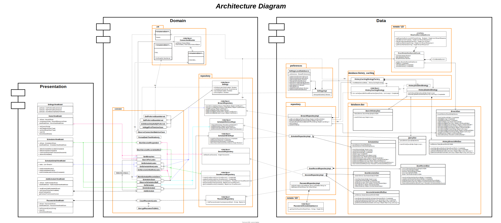

MyGuard App
===========

[MyGuard](https://play.google.com/store/apps/details?id=com.rmsr.myguard) is an app that intends to
help users keep up-to-date with the world of leaks through billions of hacked websites and stolen
data that became publicly available via the internet.

The app is currently available on
the [Play Store](https://play.google.com/store/apps/details?id=com.rmsr.myguard).

# Features

# Screenshots

# Architecture

The [MyGuard](https://play.google.com/store/apps/details?id=com.rmsr.myguard) app follows the
recommended **Clean Architecture**, which is described in detail in
the [official architecture guidance](https://developer.android.com/topic/architecture).

> If more implementation details are needed, explore the [Resources](README.md#Resources) section.

-`SVG` resource, zoom for more.

# Build

The app contains the usual `debug` and `release` build variants.

The app also uses `product flavors` to control app authentications, and where needed tokens will
loaded.

The `noAuth` flavor uses static local test API tokens to allow immediate building and testing app.

The `auth` flavor makes real network calls to a backend **_Firebase_** server, providing
authentication tokens, So users can use the app safely.

# UI

UI components at first [MyGuard](https://play.google.com/store/apps/details?id=com.rmsr.myguard)
releases were built entirely using `XML Views`.

As new futures are integrated -like **Schedules** future- 'Jetpack Compose' is used to build the UI.

The app has one theme till now, which is `light-theme`.

May be `dark-theme` implemented in the future.

# Resources

- Database diagrams can be viewed [here](docs/app-database-diagram.svg)
- Use case diagram can be viewed [here](docs/app-usecase-diagram.svg)
- All app diagrams can be
  viewed [here](https://viewer.diagrams.net/?tags=%7B%7D&highlight=0000ff&edit=_blank&layers=1&nav=1&page-id=WIBez5ZPqC6xa2WDKK0G&title=myguard-app-digram.drawio#R%3Cmxfile%20pages%3D%225%22%3E%3Cdiagram%20id%3D%224lrCkOhqWDYaVESIxCga%22%20name%3D%22Database%22%3E7V1rd6I8EP41%2Fdg9XL18rPa6b7vbre3evvSkkCpbJC7Ebe2vfxMuCiTGqKgUaHtOJYQQMk8yM8%2BE8Ujvj98ufDAZ3SAbukeaYr8d6adHmqaapkr%2B0ZJZVNJqt6KCoe%2FYcaVFwcB5h3GhEpdOHRsGmYoYIRc7k2yhhTwPWjhTBnwfvWarPSM3e9cJGEKmYGABly394dh4FJVq3VT5JXSGo%2BTOStzvJ2C9DH009eLbeciD0ZkxSFqJqwYjYKPXVJF%2BdqT3fYRw9Gn81ocuHdVkwD77w0HbtH5cvfV%2Fqv2%2FJ2igfD%2BOGjtf55L5M%2FjQw7JNo6c%2FdJw1xQVPRNbhVT0fAmtExBS2d4rGwPGiM4Ed%2FUZnkt5co6evgwsb3vz41enOeucavJgdq%2Fr82efdD%2FAsEUTw6oxdQAZR71kjx7WvwQxNaa8DTIY6OeqNkO%2B8Iw8D2jWVFJDTPo5xpSuZGgN6JSmmpaGooB1f9EzOx9eoreQ47kvUqI9e5oDQ6PUwIPVvk6FU5kXXIMDJVYmg6VkbBKPwfvQAuM6QjphFroY%2BvaHjun3kIvL5NISO3pMUVizUf9DH8C2F4XhgLyAaQ%2BzPSJX4bEuNZ2QyQ%2FW4idcU3hNYj1JY18y4EMRzbDhve367O4IV4A3JwM3vZxpK5n5JK6nbdTh303M3Ay4ZKQ9g2KOSC9IQJR9SD7ooCkGVHMY45k8XLkCTteAfcKcxKOMJnELpCEzoRwyeaFEGfVTQFgWe41EZh5CwkOuCSeA8zaGVBXfYzhzcz84btO%2BiNU0NQft6TRoL4sbTKOWiikVkiOMc0DjYS88Hg4tFwZSWAuMsK%2BVV2MujIQ29DAwWMpcUsiYvZPL82AHuAuN5eYbz3EeTe%2BAPYbIsTJBDxXH2j4zdXHLskGM0iU%2B68Dm59glhjMaJ9OPhmDcajoXZI39kdPrKJ%2FPIJN3tk2N1cUz%2BaHUf95FHxE%2FASNuABBOvMMA5WevystbkF57DCVdnhHv733riDa0MsBDv2pJTcpLLqxZEBvDZDdXEyLFt6G0hEm0TkehrSoSz0q%2FZ2lZLuaTkDUbyT6HR8nhFLjshZ67IUB4WCclyHdXtBRNgOd7wOroyb4WYB4PK29KVWm0XCh2p5orFzpfZ4%2BnVnQ36nfbXS3T527HOXo9Z6DRqv2C139qj2ufK2Gy0%2Fqp1Qzg3yqH0uV1sVVXnC4FcK5XPHYk2I3cPjGGk7AfYJ6q1Hvp%2BS5hUSN3zqKsjrUfZQ0pf2Sc4Qsc1otgg64auKuGQ0iouGqLbkLpLAyhXCTvYhcIaNgws35lgB3niejGJJqgSGbCnZDCE1SavXp8MVvxsdOHP1uhrRyeKhcYTH42dAMbm8LUT0IouRea84SGeIyxN8h1JkHtGCgAsuZefCpL2SXbKGByLhQLcsYB7Et8gnKGRQZSayj7CID216fyPl%2BadmTxdSZNHba2vGDeit4zuahsI2kOYrEhkQBw8u4MuoGA%2BW5xh1qQRHidsLPTsE8rKk8Ozu3foo3t0A7xZYjIvzo2BZ3%2FdgPcM0NS3kt6aHQv%2F%2BfIw%2Fj1sH7%2B7j2cnsH8cPxROjDNqD%2Fg3Z8b18%2BBlNL45f7%2F4CY8vn4712G6gjyyrR1WuAJNCPxyqf%2BnWhOvkLQonqzKPpWR52raRayJ69PiqdCwg15CWa6iVbygaG6ahDRQzd2Q11tge0OV3GmqEgQU88o8oCeTbrIZuogC7iQLoehYUhikbBVDX0%2FhJFCDh%2BBPi1%2BCsh%2BreLUn%2BUrCGd1hhBoBvXoqneCmJf%2BF631AAa8pa38jl3LNwWWewIiSAGMu1YgH4Q9FhJB%2FExsajUzfqf1uwVIgLkERPE%2FLfuebfJ%2FfPF7LWaP7NVo5yhfz5faxsyF%2BM5Ubz60tD%2Fo3eXxMqVdb7v7TLlz%2Bdvmbct%2F1Lb3r6oLRfG49%2FD3pflgAvQjXwhdx4%2FCtlLZ4d5dD7%2FD6yHv95NfS%2BGMu10vv8oeB4%2FDAIHORlFL9%2BXg%2Fdvy1cqqz7%2BZqMpxZoIH0aQP%2FRQ9h5dpIoeQ8hF9J4VS7mHtWywsjovTOGTIWwLWC9eOjVjSKMouZSFaPWcsDdSficwmkH4fOCrAdVkzQfugVoGG4gWWFgkkQxA3ZlqVXYEvhWcn%2BTjzwWFsVEMXORbbUrGcRUze6OUNIQiMtVk3BalTJyKNpR0rgRa0q6XOwht4uVJQ%2BFQK6VD8EdCZY6rG%2FQcEuoVNl%2FeFO7X4L7yZ%2FbC2Vw%2Bvn2%2BOUH8I7VRuXvWuXvM2TIl3Gj81eKWjw5yqH0%2BX1ktX5FqEMxlmul9vlDwer9v1Poz%2Bqn9LdFSpW1PleH8V6eoNSdE9xM8Sq60PIh6dzy949SHz8w81eM7pcNG7YKYHS43Dlr3sWvLAyiKEPD%2Fs3Zv%2B5B2b9iEhlthZU1zMTauQLCyVVK9o8fSms8gY0kvZHVuV%2FRstZgRdg%2FIZBr5QZwR4Ld%2FMXbQFALP2BLpFTZDeAOzbK9A6ss%2FF6IJYKcFXUgtfSENcDEuYPEaw1wMAhfqZasfOaJ2%2FXjeif%2FhuEehJWeSrLN4Q4GE%2BTlPaAP7McUY7jIcphqERsY%2BOqNNV0unQCjsJdRSlfy4ecdfK65R3PAZKxGW9KH2R1KmvRna6pHY2dZTzdIBSIpZIncH40XI5odJXZjEnajJn7MHMuNI2OyXGVN4xnbIqV2jozRZMTMgYprNRSvJsrCaxqVzZspxnujNQz21alFruwaa4ta5syUNDRYyAwg8EMCYc4pNBzCYTgE%2BbcgWtr2yoSbbpZ9JW%2FpQtJwCJkJVUqDgSvjhkLYLBVzR1rSBxOtymcQSGNKRXZGChG9lmTMQhW8TGt7yKXO2dNeUyJhS6C8ZcWaNuWKBY5Uc%2FsIiC6LiAahffiNokiYvjzE2f2MIonWOvOm42X7JxdxSZebwZ0s1SeWBYNgZVUQVhOkTa9a%2BHJ9e0M6fqkUYFRyE5ZzeG1GMB8rYbkwT1M6Y7nwO5xWZiyP5dvptD4pqR8t4zV0u8qnbrc1%2F2mzK5Yw27l8YvNWK%2BevMMnRZTObt5RcivTOzjKb%2Fzcc9n61Hi5vB%2B2LXuczfnwBL7yUANHGIbq8LVKcNyH1A%2B4KLiSiztG95c5rzoVr86LicjtPOL9LGdjn9liTF3FdnXLh1CiHU87tYmVzEwiBXKvwDHckmtwEhUGlynEa%2FrIm4TLVSx9IRvW3VBIH4Oj5PWZNvtuX6ioNVd5gq7rW4GSsqO1LLdtipcpq47czGj76z7Pu%2Fct3fD4C37732zKO4vpEm7Y10ZblNFg5y9JuQjYtTbsJ94WU5osCjRyf1lI3pNPMXENmvqHi6DQu7CSc148MO1EoaTXquiVDnZnjXlW1KBZXVfIt7Rh3Ennh94e76BwPedB9CuskMaKtwCh60XMlGEv3Xal6PqSg6BuCMb%2BYdvMNFYdFbs4d1mGjIVOn9jmGD%2FjVqGvspyvAj%2BNnYlq9QtWWuRdOo1K66tweN8z9hknKpCV9MNFWlrkXArlWHAx3JJrsgsXgpMr8C3doeO%2Fihek1pgl0Hh6uTtltcUQQMNnBtmR7HRbvrBs5uevp1%2BZUYx9cMXaC%2FDa4ndmC67qr1G0s4%2B43UaLxtAsqCvqVyAM9SvsMRn4nmqz%2Fqea3tElycEQ0YJaqFhtmS%2FurZW%2Bjxz7OAphRg4Uuayr71tjHRK4seSIMPJQIujnKY1Miz8g7zqq5F%2FC2tGLBe2mY3%2B5u2186p2%2BfjeNA%2B9mxHjjEDIPd9ei%2FCISSrLMc%2F1goQygy2tIgF6aOLg%2FI89tCNwZ5riF9d2Q1F4cS%2BUfriUNReKU0MMyH2PRN7QSjk8Pz7mJ1kx7wxldt7ysYX1x%2B%2B6MG%2Fb9TznJ4Axy67%2F2UWuQgYL%2B0kBjYOAtGhiXMW%2F1j4mKGgMob%2FlnaiTJLYIpREGN%2BDU9kBKzR1IcXYMJxRLo5B3jZOzOyuF7u2Sav48wVJ%2Bfti0SXZnxTczkAlzgZ5NBHCKfR4IPJ6AbZkNb4Hw%3D%3D%3C%2Fdiagram%3E%3Cdiagram%20id%3D%22V2pjxPVCgDuZ4CxXui-R%22%20name%3D%22Usecase%20Diagram%22%3E7VnbcpswEP0aPzrDHfLo2E3aaZtx43bS9k2GNagRyCNEbOfrKxkBBpH0Mg1xOn5CWt3P2bMrYGRP0%2B0VQ%2BvkI42AjCwj2o7s2ciyTMsNxENadqXFM43SEDMcqU6NYYEfQBmrbgWOIG915JQSjtdtY0izDELesiHG6KbdbUVJe9U1ikEzLEJEdOstjniiTmE05reA40Qt7Cr7EoV3MaNFphbLaAZlS4qqOVTXPEER3RyY7Dcje8oo5WUp3U6BSEwruMpxl4%2B01vtlkPHfGbD8%2FnX1KXqP4rkB9vXsehfdZmO3nOUekULh8HF3VSAWCeNkvVY757sKpf1RQc5ojuyLTYI5LNYolK0b4RfClvCUqGbEQsWzL2r3wDgWeE8IjjNh41R2X9GMq06mV9XVenJUQhl%2BEDZUTZqL5XAWi5rV1D7LuWZGY7ignNNU2VaYkCkllIn6niD7QgdP4Sl3CdsDkwLzCmgKnO1EF9UqnKMcohzet8rqpvEet3Kf5MB1amEg5bFxPXXDnigoAv%2BATEsj80sOTONQOOJaFouUTEIuUam5%2BYCWQOY0xxxTydFSwfgIeQdcH%2FLo9GN%2BSG2P9%2F4xAedBC3%2FLcTUC%2FB78Tee58Dc1qCESMUZVFQqNgqRrUsYTGtNMQE%2F3Piyx%2FAGc7xSYqOC0jTRsMf%2BqhsvyN1k%2Bc1Vttj1omu0qBXTYgSyayJjZbEtYLrE87r7%2Fo%2BzktGAhPIGBXfaTB3%2BSQwYEcXzfDr59jKihc4rFVmruzaAtvlp91RQcsRi4GtXhtd7G31Nta1JbgAh3iQybYSgolnv9AOgu132CEJHT4Nfh8wUkZfltWE1bD2qW4Z25PbJ6trDmaVjvM5NxS9kdMB3g%2FyW%2BBU6bDNvSyRg4wPmnCDf2XyjCnfuDRjj%2F8Qg3R3m%2Bofs74isMcV1cgyMIcWZwEtY4eBlh1WF1IGEFurDCBKJCMG1dfsnyuuIRAeDFUlzgvZjvkfVQKgWULXP5UBeNp%2BT3hNT6lDmE%2FLw2%2Bo5zBPJzBlWfeZTqOx9GfYHdUZ8zrPrONfVNGSAu5GYsQpTJB%2BS5uB3mMtEBwzSS90Kye1VJzu1cHc2eq%2BPwSe4kMwGCMZDOOl%2BnbG9YnVXn7Ls%2FVvku%2Bic57hjV57evmJ5%2FBOpzT%2Bobm%2BYLqS8YWH2Vzzbqu4GwfGVT%2BU2UbiAvyGvTVgdZxziGzOadtDU2B%2Fr0271B1h4wlLb0b79zBrnAC%2FFSV1OCYb9jPb%2B9y1aUpTLz9TROVlz%2BrmkU%2Bpp02WHFfd73OlFt%2FpyWzDa%2Fpe03PwE%3D%3C%2Fdiagram%3E%3Cdiagram%20id%3D%22WIBez5ZPqC6xa2WDKK0G%22%20name%3D%22Architecture%22%3E7V1ZV6PM1v41vT7PRbIooBgunaKx1baNdrd948KERDQJEeKQ%2FvVfMVQCxYYUBBL0xV7nvAahisAenj1%2Fkw4nHyeOMXu8sAfm%2BJsoDD6%2BSUffRBHrWCL%2F8Y4sgiOSIAjBkZFjDYJjaHWgZ%2F0zw4P0tFdrYLqxE%2Be2PZ5bs%2FjBvj2dmv157JjhOPZ7eFq43NAex3edGSMzcaDXN8bJo7%2BtwfwxOCoqwur4qWmNHsOdRfr1Hoz%2B88ixX6fhdlN7agZ%2FmRh0lfBU99EY2O%2BRQ9LxN%2BnQse158Nvk49Ace4%2BVPrDe1fikK%2FRu%2Flp%2FpMGjJu5fXGutYLFOnkuW380xp%2FPCS7%2FPRifd4%2Fn7x2QqnJ0cHB2Prg5bSA7WfjPGr%2BGTvHJMl%2BxjzC17Gn7x%2BYI%2BZvIMZt6vE3vw6h07MMbWaEoOjM0hubUDd2b0reno3P90RB7T6ow%2BWdR0yIE305lb5M3th3%2BY2zPvSvp0vWvcuWM%2FL18kJkdGjjGwyApHlkPIx7s16cg7ZIzJH4f2dN4LbxLRzwGJyuQ1HTyZ8%2FmCroYkTA8tKUKRyCGfCsxBeAuczzx8N953Mj8ipBi%2BgxPTnphzZ0FOCf9KHjkOCWpBaTH4%2BL6iW42y1WOEZpFEzzRCZhktV1%2B9d%2FJL%2BOphMuhM7xY%2Fr85Oe5ZzI6CnS%2B3HmRpSTpQKjuyJYTXvv4L3r6D4628pUpIAENYhCtDVEihgfHJ48f1lcX2Nb3%2BOBr%2F%2Bdc%2FOUUuUEiTw6pp9wzVTacCT0f4LZR%2F%2F3HhYPmwkBAeWj1oKD1zZrhW%2Bx5B2HueTcbjCQ%2FAqzh%2FogbHxYI6701PT8Lf0jxFVMic0Gvk8Hhsz13rwb8TbhpDKq%2BNab%2Ba16QbksCKuQ3tsO%2F4XkjodzVN35ItY4zE9PjCHxut4HiE9%2BhdfRTAEu548g%2F2RlqDuLZJeQvIoScpTBYjwBLkEwgM1EE7QXSrBvRuLmW15z8R%2FU5TkXHvs7XAQvmKF%2FOqfZjrHb%2BQJuiF5%2BMf8u8cH3%2FAR87rDl%2Bp4hGJEKMgmijDyeWY6FvnePs0FAu1qdeTAnRqzG%2FsquEd%2FU4DWBEETOF55Npdyv3MVx964TIFe5I3LwAuv7HVrzeuu8nVjpMfetyIkObyq9%2F30oFz15q%2FvF3N8pXcuRk8T%2FR5AFon3bU4H%2B54FQD7ZM3Ma1wTkj1R0iv4DNpw5PZuI14k9Hdw8WlP6J3quTA90LO9%2Bj6JAJFQ3LAx5sOdze5J4VeaA2BnhzdrO%2FNEe2VNjfLw6mlNcu%2Far0w%2B%2F%2BeyPbFjHH%2Br7ofTc6fR%2BnWqPkxblUHL3I3OecaIYvmrvDrnEv9DWGHFA5b9jjgnef4vbUhAthIsHNB9VLHGyQ0iR27quC6qoyaqiifEVg2cQLhI1WRLrsqvitiIgVUQaliVBxvFlgyfGsSzzBe3h0DVjlxAKMxaRM0Jhkv4AJBx%2FsEgIn%2FSKd4I1V5y0fEF8wrTfenDf9x%2BQ%2FuvHj4NFp3vWm0LWW3ncRWFONWz19DqZUbYynD49EuyjcfFdQtgKwuGhkB9ARTkS1Fm8DIm12jCkyiA9FcltJMoywpqmalhgOIebIXW5ragCEhVNlUVVF1iql5XasKQqxx%2BBrm%2BDI5NmVMORu%2BNIuT4qUhPj5KgJYlsRCROpMlYUWS2qIpGut8n%2Flj9U19Lb1%2BrLkURc6KWypOQ4v6Z99Eu%2Fve4M%2Bubp9MYSAQPziGD8BFdu1bOVdDIkPV65nBElusewtEv3GBJ0DvfYyn9fvntM%2BSnt3%2F77c6w9du9P3P7sojUfA2arY848D5YdLl7YQaazDjK5zg6yFeWIST%2FtFqlkKZapJwsBdi7kQtVRCSRy051a06cf4o15Prn%2Fu995eb8gqj9p6vb6xvTa7NvO4HpJLd3JbJykmHdrMjZ8TmZphVPI9B%2Bt8eDcWNiv3hcliKD%2FTD8dPNqO9c%2BjBUosUQQhKrEzet6VS%2BrwiOKKvj3EHLowPmInnhvuPDwQpzTvwglRO9b0IIQeAZkFEtW7h9Wn2BlRx6nCQVyZrMsSlxeL9O%2FSHPCQnMi47RVJSYolDFCcqKQTXLgboZG5MR2Rh7XajhGDCkpuhyACl%2BT4dsaYkM3UmJsH3sNzE2SeT8PClC%2BuB71ja2omBAaCvXJr8OvEGgwCuBmQzI3HAEctlFDS0urINY0%2BAE4%2BX3RGpK0TnAt4EGcE9h7aU%2FIljMDnZxKSfzfdORc1r6PebKmyXjYu4vS2jlC0iuQgIAZN1yWPtpGBn10GIkWKCSUV8C6LUmkykDEXNA2Ikyr1EIGNBKxMApYiACEyKUEAzl%2Fu%2Fyqz%2Bf3CPrs9c16GAu5%2FALTQ6z%2BanlVZXwnoR%2BUbCbhWAkpxkSQhrY2rFIF8%2B0HZQhJD3uUKQZDwOaIRjRBcS76ZMoVbCEJOE4hMShCCI8f6uJ2NXu6Pb3893fdb5%2Bb1w9Kkj%2BQVGq773pjCdRSCqeKOQWAqdS5HqEoCbQs5nazShZ0useEkDCA%2BjUO4livsQAJPCrsW%2BTgy56eG%2B3huGs%2FuIdl7vkcIYv5j6B38Ju2TM3pzx3vT4qH3FcjR3utwaH14qdOrv%2F4v%2BND1vOfkm0l%2BEp23vDsbW3PKSN6ae7ELrgzLIVf4juLoPvR3ZTRfEkuE5QgxrFzQjBDOL5dDp3dMBMtJEewdssm1w7HvG38k0tyPhSVScGLi94C8%2FEOB6EAiiMlXwwdo9XkLsjlT1G0CUEEuwiW4KsE75ghSNop6S8SgchJDCYoa9r0nBRlRYkb%2FsdHTn0dPM7FlhNQEUcmQUYJQIUW9Usx0Q6CGAalbV9QwgSuNtCtB2mULj010H0iZlYk7NQ23BVLPdA8WxxPDGv9wrh7JC48DrAtj8WBShHVuuXP6e3Dx8XRuzRcrnLX8bxTDRbbqDortdm5H0Ry4i2saTv%2BxYzt0r0tjUvC7segR3s94M2%2FsU3IZURh7%2FwP%2BSr5s7IQGhO6WE6mXfC0nVpVTkeTEmWMOTfJF%2B6abxBs5kipEIZFUEZ7RJFXkSKogwhIlaQSMuEhyW1Y3pxM4tpLM4OqZ8zlhG7duyFRCXxyZqnmJKpGog5MuJDA8reB0cspwITHAVII8SNsHpjBdJwVgA0xLChouZQa%2FOkyKuq2mTYiQmXLw7VD8ti9Ybnfat0dTYo0fT71XMNgLQduBbY9NI1mn3aApSj4Jeb0tetL56CkrLshLUPfjh6Pfx2h8st%2BXf84eHOX31QGYhxNozXObvFsvCboX5NnXSYF%2B9Th0fgUaV2gYCP%2BKEFll5blmeHbYkE9NFOj8xRn8PXuZaD%2Bdq9bF%2BPrH4eIOiDG2AnkZtSOCsMojeS%2BDqwzzAhSYq7T7%2F5bMTMKNGGYQGWbgMVEyRdRGUW2I%2BqUSbFbwjpMk5ylp36lDk3xcL%2Bu764nHN0%2FKLlwomBdc5WZctUc%2B%2FC9xBdlnLRRIbpK4JDwXXP%2FH9NJ89wOYP6bjxaU9t4aLtTtAF2Xu0rEcd74%2Fm12%2FTjm%2BQPxs6KG4ywfJ%2F1gSl6xuuIFTBdF4OXwO9CUB%2BRyVESIFb5mjT8U2%2Bhag9dSUUs4ZFdD%2BDa2t3jTHD%2F7t0Q1yg5po2WYmio7WbWYRDG%2FZJopBFto1Y9OKTay3dV2VkI41VRE1VWeyU0SdWZO3ZlPEbVUNFtUUrKuaxiwsMq60tTWb5RVpsnUn1AVYVokmSD9JB9%2FAk3CGa7Yfg4DBfd8gNoUXhdjELawk3MLSt0%2FsFoYa2mzHU6ypcZZrIaASAAmgYVJGPEG%2FOX3%2F0x0b5uLu3bw5FRxVeoLSTz1r4MDvDTQ0iGQiHw%2BigaswGnUY0FaPaMS5OQLqOXdnD%2BM628O5uqWFz7ADXlSKac3vooGTqxEGImKQqasXM60VtluGzmlas82ZyjWtQV6CurKFzsjh6zT4xRPJ5s9X01n8tuaPHe9eaLB5zz9Mw%2BFeCmJa%2BDpE6Yf2ZDY2A1TbgG8%2Buzzipy9ul2dKUm68DjiJQM4po80YeMdigl5h2d4x%2BnDJ%2Fg5dnnIj4rcl4pWk91SCQIpSMC2OqRHntmOrrVgEOQbKAfb8IkPHnnj9wfdCBvJ%2B%2F983D4HuB2KfEzQ1UnvbUlvkZo70DCCQG8rwpoIO%2FKTUvgX6DSf9LIxzZWC4j%2F7DQnHDLW8jR%2FPDmv%2Fxrm0LghJ%2BvvOubqu6HH4%2BoiLX%2F7CIfIh0Bi0g0qK%2Bkyx%2BjbpOsnT3WtcJVB27cY%2BruPiTpbaOkKoQKIA1jXyML8jd4ooJgcmq9z6WC6tMRD7FWZLXESIxXwaFbqWyHCH%2F%2Ft0J7un03%2B%2B7kfX9yTruW5cSkBIXStvQQ11HE%2FXLZ%2BPnBh2YJR0VgMeQoC1WNocwihuWS5i925gtSOEcfvUm52ktnWYKj41y8UGy3Fz9gzesJ2hhlUne8%2FPXabp4xJ0QOgx6VsAEYEI8m3oeLuO5KaiH4tpXdeQF7QXXNj6KLQUIyyFdKHkdIt0y4oMgdK2yz2tN44MlA1oxCWizaIM3Fii0BYXm3tHoBC4J30pKW0XC6oe2gKP7sHE7XoTrLYsELCoSwqqm6MyySNpdPFBjnmUIbSpFwUAnxSzmCmVqzAokf440RGaYLdVETPDElHwRzyIU2rqu0AOhSbg6Y2UT%2Bp8W0U%2BsVVglm2WxT5TNjv7Y9i%2F57u9P6%2BoBG6evw97DA3fIvQq7UdTFtioTc07TVEmUdBqIWfY%2BLGo5ev1yBF3DOsKyLuqY6V%2BGMbNwSbYjZufshB0S0%2B6TPR%2BpcvVclgyXhjDpyHKrMzaXiLyxN9dw9qatqhJWKJQ8WV6nKp7twMYG1fq%2BQdLnmDnVGKHFkHwZBeFV9b%2BAwQaU0psONh7GtiduqkAbxRV%2FlkKvtcNY1LIVv1hY8QvZil%2FhU%2FxlVSpwCJyvZi1GsDOOIec1qLk4F2xkZfJywRasTHGNlYkKWplonZm5w7RTRY2jB71cMzNLQH7RUYRbCnXw5NBVlAgEvlQxl6St0HUQxpKJ9JPEb9FYsiLkjyVX6TXgBQ8bic0KwIOO1LaiEwtG9f9fY5IrWQrjlZIa07AACYx9UpGPgLH5158vbyQib13T%2BfHwROw4sqRvUQTLLhPvB4Yd7EcsoefV375J%2BzODvGyxQ9hQPJTHzuHzj8eX30d3xq%2FjXvfjcBSOVspM%2BJcjzyXk6qLzczT9GzNgGn9rcvpLyOknshzoNY0kcDS9oMvtjIYdKSKdfIzQISzl9%2FF4%2BvK7ezuVhcubs9OfqqrdAKo79F0F4b0%2F1%2BbwiNLveseVxOO4%2Bg8Vtqfld8aIVSyKMfg9BFQiC3HJJykyQJgyNHsnoQU4h%2B%2BwQ8gkITk2G8yoYFPlynVmgbwAVcGTb%2BKYQ6%2B%2BdWIEwesEf7R7h6fHF%2FsJHmki2RBb8FB7pqTapMQdJO0ykjLBO%2BZA0I1zdEfEAeSTg8RRgrMUvOG0pHFrStT4PCZjiIjZiybUJARQVnYNU6ufsnxYG9odBCusEnke%2FFOixzk28Vq3%2Bwtapuvdnxuub%2Fl9OsOlsjOEYi00L4xZ%2FNSsFKOM7prLu6OpS8HNPax6iG793hqVwSkVoihzi1JC45MS7MzhImLizkRzbXT1XTL3Ly7Vef9jfHsFwPOAdhtM%2FmUwOeOvVZINxyV4UEex2lmJaUvVgsLLCBoKXC0iB8kfRuSBwI5i8mjT6Hb4h0a2loW4MiXTJnA8hbArkqUNHK8vcWAgdwEijhLgOHjD2XB8b12Deg5QPDDJX8wDgrH3OGE0vcLrNx9vML8GfAd3yG4Vg60pXfZTkbK3mLuXBxgX6OkP7Or32t9L76Ff1c7%2BPIFNN18zXIB2T%2FPKM%2BgrO7InhGnLHZWQ3Kc7yLlT4W%2BSpN0qv02O3bi%2BESGI%2FfF42Yqj1G9gPxDJ8mayi3cIUAj5Ouf6DdypyJQsR8MpyXA%2BqOGQXgL%2BGYqSeDaRzhfo%2Bw%2FdPHSOfo2voTbGfWNKbATbGTT25FexJzFT460IYIwHSiURhYImJdOsQ4damNGOhduzKEEmgC1Kx2eCsB4y7GW6Yg5qV4ZhnlhRZGCLQlYodLYbrh3fKeuKF69eMzg9UrqZsrrpur5xECxuTHvBAeaaRlGUZPpkStmNwlQQd5bR7Q%2B848Yuri9xIMRLHRURRw7DOE1w5jCSX2cDIv3LXtVrKR5IwmABN9UszrNxltVAr93KfqElsezBvdw021rPsjT476VRJhVZHWXJDyCCBcqPEiJYLdxTfrbw1cXP73j%2FefF38UcTQasjIK7G5vgqNgeTui4pGrfJkdVWIofJsSxDipocUH5ltSYHyAGwyeED%2B2gMKwbvwxAWaDxEL2JNiCb0VS6KyxRppUP8Mmo5wDtuIH59iQNqaVYRwgdveA3Cj0uYPD2jYpAeXGZ99KvwdZwxtqE1HfykktjbJyNmlvk1I6A%2FdYH4d%2BFZqnjILXWv9XseLC5e5ybBP%2BQxLuf4VLWb10nMfwFrn9ryTK4vQc%2B2SniG0M58plj0LnKYXRkbNpq9InurJGHOaW6hMjIG3fPev%2BfJ89Pt3XOve%2FV4Ll5boL0V%2BD4ocTUlPV%2FJ9MLxYk0tR0WPlBFozDK91PiWKg1YRk0vKLJZrekFMgNPRY%2Ffih3gkSZeUjZezpRXpZf1lJFHCN5xY0zVlziAPMKqynrAG842phgpwxb2AEIoR5QjdYswLJws7nGXNk%2Fe8p5wl7CAJtygJsU9S%2FAd3hz92JT31Fh15EXr5UgLICersvKeyc%2FxjXZ%2BMnyT0eljz%2F7Xvft5m5KSRbmrQelfFKUrKoTSJQVC6UpGM4gMlJ5IAwPcjAhvPScL5AIYpbsrTRYF6k1aU9VILFNSbVTuAxG4mL%2FZCR9VNTC9vsSBOaVfCTAdvOG1MQ9GyGwQ9oBX4sPXGT5xZtlMQBzCiQ384Om7pe7q6Xj6NTb7CsZ4HEVFa8swOG630RUV4fJyxAOQzAGDI6EEYP6B%2BgdXH3d317o0mh71jk5frBEAzP14TIPIvwoil%2FV4z1lJTEZuRKgvFSo4WoydgoeBRlhgU%2FdK8ThI%2FBskLDWCtSSclSmVNgHhIFGX4SsH77gB4fUlDsBXDhJHCSAcvOFsEP7DOTHnWePqjIknDaJgNjhCoZ7%2FlwdnBfpWsHx%2FOiCLdwcbL29FoGViP2llUGy6j9ckNmurxN1IKxMkuXfc%2BACfEwHw%2FnXkGd3edo8YyF3o0dMl1ywYud2c6wLGUp5148%2B4UWQFLAQfjqb19a5KjAFOfBi4icLmguza7lg%2Fn%2B%2BtxWnXUa2XH893ggmm3ERmbjZGw1cxGpjG4YqYNFMhCC%2BiDMrLMBk0Zr%2BlTz%2Fqw4eyy6q1GUAegG2GsK9kItkmwh2NF78ajJgpqTby4oMkXoIBAd5xY0DUlzigpl0VDRwDb5jHgIiAwuKWAwivaawgKcxKsVSsad8xJ%2BSNhUvv9%2Fum6%2B5ZiSwew%2F%2FDjTUx12TxZBhEGd%2BCY43%2BmFxNB4xnfPmuN4WDE9LT5bJBPXDbfDsY4zFzw5BtEwQVcu7H9%2F2ClXzwBVQGZN8EbUKWe9%2BwPIH55rz7Rma%2F0%2BKEtXfQGFXbNqrKEe1QtypItCO5BMUPgvOk4ifi0J57%2BPj%2FyL13xP9LGlV5pt3Iwjdm2k14oJl2k8smIhCRaSi8nK8UIR4MEY%2Bc1cKYl3hOOot9ZXHx5%2BpdFp%2BehurBi%2FS9JULQIJBIhP2mMbJRXl7tefiMW%2B%2Fh7XlyURWC50ZPiOCBiFSMfyIiYGgRgTK3iGUdjAbjk5LBbaUIyggBxmlkYA6NV3%2BJQgawmPdlS%2Bw0FzpsLJZVxmGRFnnTI8f6uJ2NXu6Pb3893fdb5%2Bb1QwsBBoJnZB74wwOHBnkB5ONBNKuAtly89uXJEZH69E3xOWm4pnNv6KTBdXbSRETNigDTXDXhM%2ByAF0X1Ht4eFbMd8pLiChzNVbBXBdbj2Z%2BAeBShfutsN4ByvTgwN6WZVLGmvMQUIXdADKyrR%2FKS9ygePQy8O%2BTseNUwkzWVaGhKdOCMICeTJ6so0o6149iT%2FZmVMDjK2cUze8gGlmsOPAlxODZcd1XEm75ZvENw1iZZLX%2FL%2FDJ0n2Rz3PguaSs3oD1FDiZBWMxrtMTxoXyTOORbtorjd8zwSrSshp%2B8avmmO7WmTz%2FEG%2FN8cv93v%2FPyfjFtISUhSCh9xZUuuXjeMfoEPddJ%2FYpKfdXvTnQkpCTBdCVUdCwJY0UgoIesyFPmWa6WnL%2Fc%2F1Vm8%2FuFfXZ75rwMBdz%2FAPyOXqzj1TWd%2Fdf5owf%2B%2B2T%2F0FEX6sJv8V5OcyI5pq5H%2FMRQIGSSebLlevxybQ4JST0mTm3kc0FGyRZc3MJWBNJoIM7AGXmDm8laFQBtTYxkR%2BSgcQrKEoIi8B1r6RA%2BApfTjeBEWbE17w4v7fleZulCKwD%2FTiCkvPW4LhLpFewchLQCiUba7Zi8gTRpiLzLKJmFXXtJZJmgCnM62Hcc%2F%2BXYM%2F%2FVRDxo5I9RV7sP%2B%2BjZA8uY2NPBzaM1ZRAhkukBz5PBwNAUcnoI3w%2FzbqJGAcoN4dyATde%2FU3KvhOWznmSIY8zByOSBhNQ3TH1%2FwSfHHBtz6y26Qib4u%2FKYIrKoxnTyVFkAGXzh8LIV8SRXwkyGvSritqaIqowFXRMknaHI4Pkk1i3NlUKzixo65afTTPuXm06Fti7RRlwhLcjlEKuiMCSm6W1dV3VB0VVFlRmEx025CmP8qDpqIyQjTRFkBSPElMimUO5qXXqiPRy65qbUDb7kZMrjKjonlhCdo8G4LxKd204oDokMeaJldmC0wwVotqsleIJA7gWMkzXxmSvDdd%2B9DvZNgKZWARqlqPOJP%2FuAxpTZ5t4JIpYgV5Be0PXEbEdEeRLjQu7THQRoMoy7U8N97L0Oh9YHsaKGluPO8SM5dPhoOGHjowznPxu2aMysFN7altNf5eaZdJ8%2FyCRl9Bi%2FPP3%2B6%2Fj9N%2B797PVvRn2s3tjQqPLXuTXeDAagTwoDkLZDGNBiUACckCMBtCFlSVBe4hifHF58f1lcX%2BPbn6PBr3%2Fds3PUEpP1AY45816iHa5eHlSUPweNpEBF%2Fz4OCPwxnZ3kc8lsOhfQOAokntVMjtJ9mtR0zgEie%2BZ8TqSy22DG2mPGbIHBb%2F1IUoxwFTWJ4iiSLKEPMuttIlZ7Yj8wFa5a1AjzT2qlhPtjemm%2Bn5vGM%2FltvDieergqNRgZzl6mHTW9Rjtdj1XePHKnQyeXR%2BLX%2BeEBy1125%2BTYKryk42HZ%2Fdns%2BnXahD53hlKzBfMmMBXkyjKmXYK3LEG8wENIEQH3n6KlLREGgnqVQJRRQsEBiJTyYwya0ZSOYxussUmVdybK2BKqoBRItTwWE1Qqg6l1xfKgZDkeZENyslMiWPJdLaoAGQangArXL23r2I4PK8LSwrBizCtYDOvILuyBua6VX8Bha7Nc4zt2B2Vs2h3kzEde25eQ88tEUna7gz16M9DiiQVTFvJytrvMQFj2S5Z983TPLiHD2LijHH0n0%2FZsYF9BVZ2p9zaBcLAIrMwfkD%2BmtJqHMHcs03PXzLibsjTq%2BvOoayQwcX8pma8kgd6rrO5AGV4ANe50kIB5ywjqRrQDL0Ba7IgdWpdnUh2njkysvXbmHs%2FCy4GLq%2BGNWQMEeZbykEPiXvi1ZPrdNzqrTPOylOgYJAbKSINwxx%2BT5xPkvh3t73%2FvSrcvD%2F1rIDrGq7J%2BO9a80VdfVF%2FpcXWFVaDvAjg%2Fspi6UpiOYjJQ1rMDpzXIMcmIYdhthlgFc%2FPSfF%2BJ%2F5Wxx9Fe3xxYSc3BPVg4XedkzuZyI%2FdIrxwAN86UZC7d4o0W2UyLZMrkjbQIxJ1laBGw8qyAFgkGITROyv9eQJQp4VShwZlgo9Rirks2NxoDaXs70C0gH6XpFq%2FYydcsywkicMV%2FbzlSMXv%2BC10k%2FC%2BHpnCNN3M5w9GYTs1B1DRZ7uq5NHksFc45M8uVQfsp%2BGOm%2BQSNmEk8pLXWU2Kj4tNl2KUazZki5wqEit8fiUXSmxl%2Bece7Y3hffuQ1yKBLPhoD%2FxvyaOZMPbeRTxKUbWX4JI8E1NMcAR0d3SrG8en91cHdsJCBZxC93LedQaOd%2F3vamZYk0aRzaHIxNEW9YBcizHTuUqF5kNt3VIKslG35rdiGUTfL4zl0YKimy1ySdafCC6fo62yfK3s3HCqZ7p6p4TfYZRlXCbfJ9MTy7tMo6%2FKU9TpxlqnMNtK%2FoPQqo%2BMQeMv503donVmjfXeofePkSc8999uV%2BDcIAksE6O3KNLUa15wI6clMX7A5brF6NMykHKElZo2qamgc4g5UdVpi8dCaDih%2F%2BUk5h17HwL1ZeMirVQNq0mLKIugW3miE0jVCLvMsU9Zu5DgFOwKXoB16f4%2Beh293w4722%2F3X0VoXby0TrCBhiWob3RiE9dSY0o3h6XUyo%2FonJGv%2FULCRV2%2Fm9UegZxCaerRH9tQYH6%2BO5qwZinZwgB9qcF60gQN4XvhSc%2FRv0NR4y1Qq7Tbt3yCyxU2y2NZlPfITX5K3g4OI43G8FsE5bUGQFUHFgoYlQu3xhde2cGB6rqR3dCBEaCwiZ4TSJ8czoJy44q9gzaKK4v704t%2FT%2FuuP7on28NxdnE3vn%2B5bCDLq0hkwpHBOBlyOhdoB5%2FlQktxcZBvzw5r%2F8X5vKyIOP9%2F5nyWVfj76iJx8tIh8uDIdizxtv%2BhwJeEjxYSCcHgo5EjwA9gZfkVCkp%2FR4PHGsjt3x9Lv4YNlXsudid1S6sLPiOmsrMlSMf5lF1LYsQbl8WtZDKV%2FCX4ynD6gyGLcBBTTCoK2Gf2%2Fz0Yn3eP5%2B8dkKpydHBwdj64OaX7c7smapWqVIUZeqtbiSkllfd87JWqw6wHgRM8g6oex7dnEBwMjaItK6ToqiuNUnjpHZX2vK17SgltYJSVrFrBeS4KQJbgh0alMapDKemp4qU5nG7qxC1XdeC2JNFAWFX3KzmtlU2NWD5Kd9gdEEjutgbURuXW8rK9ZqTzCPO6O5fmff7O38z%2B%2FH6THt8PDgweeUYbbEW5LfBrDpmuQ6ZR8ee8iROwaRA8EV4oS%2Fby61v8Uu5jFtcWJGgwZA8ZoVlrhLkQsQoraFrGEyW%2BioipCXM%2BrbGSPm7KRjNq6gGRBk7GgCvHIosK6Icsjc7CtaD5DL5S%2BDCnHiD6VriHMunUnCO3zGSW8f%2F%2FuBPd0%2Bu%2F33cj6%2FmQd961LqZAXRIy9yRbUFL804pQYvU0%2BtxVZ1LCKgv8vSJwS2yhDl9sofd0U6szr5mCz0Vo01Rn0clTUOhOsXcjXF7ZKNbAU6XFxjtdJ8wLqozjTgc8Q8FRk5fntQtiLutLGKPIvzlzsQDRedpIEtY3E1b84a7GZm%2BWJevA15PNBbB3RyBLKJMoYppHiTCDKWhFQAznwqgc6WeV%2Bu6B9WZDaWFdkHXmNXFQBySURvyi1VRXpoq6JMlZQvPZSrM7QhDvJJAH9rZtsUlsS2CkbtmicZCQVwS2MXAJ6WJQGqTXUlmRJQYSqZE2gs1DY%2Bqb8xiLS25qma4qqyQRYM3VaiQqP7bbkbh3ql3%2BM6Wz6cHn2%2BOy8jO%2FurZy%2BsxUpRrwVvOJ3KTiFb%2FmQQ5XgHDxPTVK5fnP6%2Fqc7NszF3bt5cyo4qvTU4h2FUAUJL6Pey54vhYmWHaLF6eHIC66RxmxEMX7qnbEXhBqhrJDj6ePF7dvo93FHdb5%2FPCzOb65vnosxRJ1C%2FlWyC2iiAtzygfoHVx93d9e6NJoe9Y5OX6xRfQL6SGGMVrmwD0VV16y0u5C9yHouaWPn1HSENRdszG%2F7eDx9%2Bd29ncrC5c3Z6U9V1W5oWPgT89tSrRF7AMdVm6CjdcotzR5YmthLw0SsyljmNRjqzdUEyMttTZR0gusUpKuM7SxqCnk%2Fq5%2BijimC7NqCTIwJrKqyIrMTYzitie1ES1u4p%2Fxs4auLn9%2Fx%2FvPi7%2BKPJub0JH2COBfMLWtyZqrnFvDh5%2BQW8jUULW4VtWiSycbsoortaBJbJewiCrLUFhRFkFRVwpqsx7mFNem3axBNfo5vtPOT4ZuMTh979r%2Fu3c%2Fb%2Fwp7rFEmMaXGOLkEebuBO15fLvg6eX251TMckv2xX2kMhwU19ldm0ie3flJw5i6i1EarHyFvgmmp%2FOee9%2F49T56fbu%2Bee92rx3Px2vqK6inKSnKUlQgWEvwilJIAYmUqj5cDwRdaIw7EQhZvKBJuK5Lfo1%2BRMSqYPodUSc7aRBbbOD11fLsMOBQl8WwinS%2FQ9x%2B6eegc%2FRpff2EG9PktrsuQvuUsFHioJcBL4Lv5RLyktXVmAGVZHITltrpLrumb5t%2FJ91%2BLM8u4%2B209312dLV4bt2F%2Bogcmud6ZaK6Nrr5L5v7FpTrvf4xvr%2BrjYViD4GQdtTW0%2Blc0AZvQf%2BY2it4W9NW%2FnKxQnb9Rl%2BKpnC2kles%2F1J779sN%2Bf2QNT046ozfz5u2%2BDzDeCfn%2Bjjk0HcdrgxQdLcMw5A7rtEXlW33rtHO2Nsk1QUwUwrs0B1zMjOh45GUWQBh0iw78oF1RokWhWRM%2Fwu2AMmq2apvuHo3gQSWomDHXyi2iBglfXK9xxlZYkROt9vWr4HNXO0%2BswcDXArFC4RZaHQlLoCPFxLQEOmgoES939gfWRWbtOcG5TBl09S0eM2UKd6WyCDStg8hES6dJ3kJl8IbTO9O9kTe%2F7EaXJQzLLY5nyeWT1ccnZPd2yEjilDZU3pVOR8lgXDeY9ebPebu059ZwsdStjT79jPqUsQdlARhbrYhl6VPE1OFgetc1VKjAfJBGoZajUJUU6q2tQk2behFXqNsZKdno0iIUtHNdmkxz7zWG6VdSpEyyFNAaU1RQaYqUKbSWgHZiIH2zOcdbUKSIwxnaaNJiclBPId%2FaalKwhU9ElUYF4f%2BSIzCCk6zpkbFwA6VLTv5fo3Gr17i5KY1X42ZNTt%2BM1PKFLvN1t9lSLmmsrq3CkEwWyIpGZK7l1pPQc97vTlvSxd%2Fxs%2Fhx2VpOht99SKaFcDxNjSkak1XcxqouS7qX%2BiIpuGBMRmIKg2VJa8uirgsKlkUBK8yN7zTrE%2BaN5NzdC8N5jvd79h08VuPZ%2BZSAVGSKGhQFiJRIuCxA2hI1lqOB%2FYR6uHYQR5VBg0iL4YSlZNkEkoKEUhkkhTx9UUjKdL2P9e1vgGfVwDM%2FQQHIEySoynw9KOkvjGlXd2b7z6HRq59fr2J9u3oVQxkPddGrHL08Gr1aUAxqKQRcW70qQn6%2FRq%2FWRq%2FmJqht6tXZH9mwjj%2FU90PpudPp%2FTrVHidAjtPJanqQPyGiUalfQKWqOkBoFapUFSJsaDZKtSoVJHloNkqjUfNq1ExpspFChcikBIUK3jDkz46FTmJj07zBVemT04hkMfqPW56a9l%2FTu%2BWQHa90qkztAgHciN69NN8b1ftVVK8mJvMIKlW9CrBfTVQvz7SZRvcWE4JLkfJplC%2FtRtho30%2BtffMT3u7VbzJWe7IczXs7pVHaRgl%2FGSVMyasaJcwUtWm8BE4zHLepgptAbXUquJRA7VZV8JpA7QaKF84zjHuoG5VeU5VeSoAYnIVcQmoi7ANIgsmeaTj9x47tNHr8q%2BhxtVo9njSmgckusgzQNWLbUm5BlYuNJ7s6T3YZrmyQUqpS5WKaL9uNicG9QCr%2BfDWdBTTevYBqj2%2Fw2zFmM3Owbp9r030dz3PtyrN7d1DgG3YH%2BXcp6WuCWzc4Z1uBgzIiByCXK5XhnKT91iNPMqAms0E5XwLliHqlKAczfaSQICdhjiRCMIedXLENmNO0DagO5pTRNwCklMpgTlrjgIfFESHDfZdIswF5NnvpkCLU05mYI679g7WPzIoWv7Hm48ru3F%2B8slu%2Fep8eEsKbV3X3dP2yvkCDqSrHVGU0koCVj1AZqEpmWf8i73pAmD6C7xtsxYetdoqlZAbbaEAxAcKldY1IYCkNKCZYzizaXtsIOPOxaRtRHZIqo28ESChVISkJSsaJhWpYz0YoEwkJhNo1JhzJXQjd6Zt3TuT48UffnPkvrNHB29PBZbSWAImxjNYSMDUmndk0%2F8f1Opg0yvcLODZ0DMS7KUltroy1uCrWxaRXA4PAcgd5GFIyBanl%2B5n9%2BPiNQ0jKf9F%2BW1nmYCNBK5egS3G0iToHia2ypDYJCgA16K4UdJefHDCn7KmssmVNqWhK%2Fs0yPwfwyXjyaWTOe8ab110x1M1760Js9MyMEJsv%2BIiOXy2atQDttW0Fwj846cKYsed73%2BEQdAdlBd3iN1VxbLHlvw%2BLZp7ugV9t3StxyfsI2wvtbfgYCu3ft6ceWwSRzhs7uBVvt73IlYf%2Bkyrj5uKkYYSdlVLubWwbgyMiZm5s%2BoiZe2JU6%2F9iCrdRtHVUtLRuZS2qo%2FqvfNmatJz9ZiQhUYfM2DPNxmr5ElYLWMFVmtWisrsBKW7b70YCE76YIPwGYpYEMeU08q1DNxL4jqH8w%2FT6raYdyZZVa36K2nk7EhkuzFpaAI02%2FfTaFAkIUHDVqVPAEBehjL1dqNOmFqs6dVpKLdY2E7jldU0zWXUad9wk3CyNgq1cwZZSJgXRWHUKNpnpcmQSTGY2OvZL6Vgp6SSpUMdqnGS9Ax2LIT94o2PL0bFl5LxsVcfidTkvjcm6W41aRuLKdjUqTnpB9geDRp1%2BKXWqVKpOmUFnOtSsE6JplQlwbEOdNkkGlalTXEbOyXbVadJdtyaFNKZPmWoPY5Asp%2FUzFOLx6HhJ7e3Umjels9vX1PmJlVdTS5VRa7J07MeDazpv5irTdP46HDY6%2BwvobJ2O4a5GZbdEavMu60w4yRsJ%2Bta1ttIYwdVp7VKmSGxTayuwEeyr2vj47Q7RW6GqTs3rC0VmZo6bzYhZmq72v2%2FJ7MKYKE6c4SV0hdlZ7v406NDYcexJ2op9e9o35l4KWHcau%2BO9ZsTpNlBCKRMxQNsHV8UdyaCcX4F8Zbjuu5fZ2DQT%2ByIQASEFJ4lNLBEj6DKzoQBsqEHUvf2CFKVps1EZRljKlI0wAkQolWGEtDYb1LKfO6t06VggujudAygg2kVrbxaK0jDZOnWpuKUfX7gx9LekwvPTLqTCIdqtrJZU4RiaFxlTbs%2F8d1WnMeX5NGN07HjmO4zOHT8SUE9zBHR0dKsYx6f3Vwd3QzpJZfdjx4nqbAuSLOqKIGqaJqixTXSJiebwThlXsNL2EtA0SZBEWY%2FXi8pIiq%2B60yHj4ItUk4b88bTvLGZLeHpj9073KV00%2BPRT41MRaMu2VPkl4FOksoBYBTaU6oFP1WZ2TGX4dClWNsKnEKFUhU9p6DPDhxVgwQTCDD7E3ET%2BVWEZ4419an7sDci7C04%2FWMxNovqNBXN5AzyrBp75iRICnhBRlgE8r%2BXWk9Bz3u9OW9LF3%2FGz%2BHHZ4urI7T4aM%2B%2FXd2Phv5SQQKhGdu2xt8WBG2glhb470zl%2BM4NXiECxAVCZrzUjRJAgCtOxyBf3lH6o%2Fa9WRw7cqTG7sQOow%2Fcac2nHVD24dJLQt6oAHbWg0QJCVW81mfPQsZ2J71Y2b8jzug6x7rhpEfcVcBeWoPa75cEukYYmqd2hAvtt3ysI0z6U4dGgrryoK1uu1NErCN8xVLAU8Qp6AjENZsVOPLfJSwfOblBViaiqJKLbpjsPvGWJIzIRceeFxFAndx65gcganneNAgFCEY%2F2yJ4a4%2BPV0Q3cf9pz337Y74%2Bs4clJZ%2FRm3rzd91vhy4p6%2FzLh6%2B7dfy1Fbos6UuiPGg%2BkiRoj4fj9f3FoqTNR5PI8fr7NGDkjFBWp3xiJzK2F1dsrxglWLFW7S1CU5zNz1pQ8jz%2FehzbG9POd%2F1lYfj76iJ59tIh%2Bitg%2FwcEPa%2F6Hflfye7AWDj%2BtVvI%2B0IVKZl798zEvzmZevSDzMncrC5Uxb2n8VSgQtaJpgMUizBfnhIHhPvof0EY0yB0%2FyvTZrCXCaDfusshuOSJl6T%2FHelvXFSwiVdKRxNJLQbpDoqa0RdVbUJZkVRP5yLAATfX%2BHj0P3%2B6GHe23%2B6%2BjtS7eWmYraZDduskyI%2B8FnHvGT5xk1voclhiZ9R0lLaZC8HPJEZDRPp161vID%2FQ7COvkl65oeFwnlEJIU18TbkhZgy8av4z2MW3HELOx0BEHjsZ7L8SvSlJas0Y7bdCvyNNP6VOBrrVmTTgElYyakcYImmVdfVQ%2BaZAbdIIbueLUVsww7iG6nIAkNHm8su3N3LP0ePljmtdyZ2K2vZt2XboOs5aun18mMnmE4fXok%2BKIaxHiCcHgoVMF4OMl44EtXasN3zLKiXpDvWMZj16kf4yGOjIpPxXkV%2BtUyqxui1H5%2FevHvaf%2F1R%2FdEe3juLs6m90%2F3rfpoGcZEkqSiWmbNOrtzpOG4t0EPXXypX4Q5PfRsl%2BV2gxnvP4f8SmY82jT6EzFewr1bkPFYDza7Tn0YL8zCrhPjNfk5JdjRUvzFIYEaslswpOG3ytGTpHC6f%2FiqqpKjFUrOTA6ISk53%2FDF5PkHu29H%2B%2FveudPvy0L%2Buj%2BQUFc%2BJG%2FmJbYKx2saqLku6iAkKYa1dbqnKpACJuloXsSqxSdqCImbeAnsBlrchWTnyhD4VpNm%2BFV8yRsIAp2eKhN2zektnbXGGCwv6wOrDzJjVnWou64Tl%2FYp4maMt9afi5W2zngzE7OvOehpuC5EfxhstCQU5sbXGu1YjVpRz2StbYsV8CTqfC9oCXukO%2BWFsJXJ8aAz0Aa4ADKtJPr3pTq3p0w%2Fxxjyf3P%2Fd77y8X0xpiGL3bCqJTCEsO7mUW0PS4SDLHPTaMObSpUFvDZeLX41fJ0L%2F71i6OTw%2BWozfxs5v45GaOxE%2BI3Qw35%2FNOpbjzr0ij1vXPDSATIumwqP%2BFR6IrbiACmtDeR6v8GDUXqF%2BrkhLFjAhHfCQKAwPllvfAdJ9U1RbRnlHpkjZpLoDJJMSqjvAGxYBWojUbJDfvKZpQmvVfUU4sO2x6Q1nF8JCjuUBhoiaSo5NKjnKoS%2BgkAOkr6yyto0IjMP73tiV69%2F4Z0oFR4z9RxXxhjm4IuJLut1OdgWYClOI2FknJF%2Fqd2b%2BD0okh9eh%2FghMbaZpe7vIHtcktY2QJuDwR2XoTYm5R5jleakYCRJqC6oiaeFPfBfeLIq8FlVLYgBpKCDKsqjA0Hs%2B%2Bvc8F6Hsrof3IsaIVeTPZeUrrM1rQLUJz2nxVfWi6XPM3enV5TWU5pvLV9xTezizNot09x699Q712njqRCUWtVbVeFEJEkSpLUirfwVxkcj0sNM15k7r48fzvnLmLbAXlJ0SBErSfHHrT6emKnOo86qvmrNpWeqLjTknHPM11F8chRfbSIaL0mPlNWdLjthSrpzIiDQl6XjebtHZF8v5Xw9awAp%2BNbuEv4pCNTBTAKqXeZ%2BNTrrH8%2FePyVQ4Ozk4Oh5dHbZ4LePqcU18VU0R24osiLKk%2B%2F9X0DDWJAYtMZvUqTEvqPkK5KDWF0fkryfz2jz4YrVkQEErJdYaxGJtCsqYBH2taB3n8n7oQkKdEEXmS9g1othWAfuS6rcDJkQtbuupWNwamIDfd77S3XoLva3JNF4fX31EWmlGEuOH1nDtRdpXUuvRnHZVpwfCllaKTA%2FkyWqvAijzMk29cXJLZJPZpaIptIjhP7WydPbSgMAXc41X0YKhBPUCmpT0UX8i%2FSLJmdafylh%2F3NFWVY8FbcW4Cz7RsHSHrnJBZDh8CwFa6pr6KkxaQvyqbFbk5ERq5daAExnjVVah2svcjCizy9aG85g%2BFnTQVLWM91%2FzwZbMVojXgqoPX7EMgMvhK5Z6cZ2afcG0L%2F7HaB%2BOP4jZ8YetayooDlFzlmJpXymHpVj3bXX98zZVVeGdVZvElw8j1qn%2BMMqZ4U4sa3L6%2F6rkxkzLLJYwCy1YG2YURT3ThGMdfbzsyBpGYnVpFflttrgzUw1H0qV%2FFabFSMn1w2C4H38N%2FoU169KdGXdlCvryr7t2ZWb2nI1y9%2Fzl%2Fq8ym98v7LPbM%2BdlKOD%2BB12wBtyN46Qri2IbF2zij4X1a22DqcvOpsqfR%2FhpGK2K7PesprBRxgCnVNcm%2BV2W18TouftPMZGxCvtklEXw6ItV8%2B2EDeD2MUC2e82rQNg6P6ko4FPXrFM%2FjwbK36KlviHinTABd%2BZXvTuJl5Ulwa5TKxYA6zaTPr0fD67pvBE68Ue6WPa0NzfmTQuVT9xCRWQkvExH8EVbqNCUhzKG5Opqm9lRBHakvBvrj1FpGxWQAziwUNNGZT0BZwmXjYbkgmSSTpe8WZHgDUMpYwc%2BLRjzV%2FeXd3jP75ZyKH7bFy7N%2BbvtPPf8P6aNy12dHghW%2F92Jyth77OwCYWsWhvqa%2Fiub9F8phzChQboQYbLR8dIoE3FkM37i%2FOztZGFrdGzKgmoqoJlYVWnY8Gutsl%2FrNq2PeJeSMHAqtHX%2FrlbBU0FQv2VGT8kH1rtb3DrJCrys72gi18U6YYurxYLWicyktbYQasvSsm0Klisr1arEl3v0x7Z%2FyXd%2Ff1pXD9g4fR32Hh4ANFfTEZvZ4qCMEZuKLknM%2B96MHCmYF9a97gIv87g7lud%2F%2Fs3ezv%2F8fpAe3w4PDx54OhxGhOPD2PYMQEYUFerKFDXfEONbGRmzuG8FbVaND58nA1JqkzByBW2XEEJqW8QSJr%2BJiqoITKp70TE5KtODU%2BH0opRlEPJ4BRuotU4b0kbqjNDYGdAqVNbwNXu6AS3ua9fTrSUTsKjpiqYIuqZgWU8MzypaWcC0dUASH%2BrJ3bgNMUXAipB5X8vCG%2FD0jVNMYDO4UBkBwwYxWk7libxFOeb4wd%2BTIrCNuABsDE%2B%2FK0Pd3HyRBb0EiXqyKPSSgT7SZWVTssUxqtgWlMhPMUZhCRLR9hElM4os5OKT7NPjfLK6uPqeoTlj6p8qiyQtXWvdNKXiHJvZG3ftzIf6NNGVpKwJaDISYhPQ2BoAbsTMhvBVqS17UUyiOEUBKzvoK1d6nDJpC4KGfYLDimmrXEWjpVuEGS7rKO2PTw4vvr8srq%2Fx7c%2FR4Ne%2F7tk5WnazyUP7uqpXpp2WyDsNb3HnE%2BO2pGqqqiAkI0nFjCsXYb2NNOyNO1J08v8aX2JibljHNkLAYUPhdDXKXEDgg7x1lQWKSbBCQDEmHjWPg1BU9JM5fZ2YjuEHGukfRrHT6Cf%2F9AcnxprKy6s9D10rrcAu9oYOIGX2EVwU%2Fn0VBguWcWf%2BjAL%2BhQQvXtYKNaH3l1AZJrfo9Y1p1zOYyQOg25EHGeyYEozbYb4Djse%2FtpjvEJGT8Ri4J1FHjjGwyCZsZJLJgFgf2qOPthPxgQzMofHqv5htuS0YZvVUKVHbtOm3BghKFRO4%2FS3hykCKvFZWAtkTSEJtHDceiMBoI0mQJVnVCDDRwmqF2E3IWluWkzchK20dK5jcpKR7SzC3VG56BSxkICduwGsD643y2ZFhjRcRHoz8CTi7Q1TGkbFwuS%2F4bZrPOda%2Febe9K%2FjXvyDE%2Fpi%2BASNDwoB%2Bgqu%2Bdmx%2FHQNnqyjuSD1OOhrTOFTLYFBeZyOIwRBUUZAgmiBNZOjYE4%2BW94gmCgfxpOilTUhqJUcbqipCVQgawJNCVuwkiCJk9e%2FfneCeTv%2F9vhtZ35%2Bs4751KQGD7uoH1x42WuXUcue2s7iwB2aE8B8aNPYfRWOi6iUoRH7itaktLChtAUfcKxhARt4aADxj63344Bnj1yWLA50cERLaNNUoK7pVLvwCZQYf%2BgrfKy%2FcOZ56wnzAff6R5WZe0OAjDpbKVAkbwaMUDmHD7qXFYgE95iXIHvgB8qHRN72PBweRjNpVMQJB2hZREY0mKFaHkKIe6iDsES0lXoXMtDbWFLT8SVAuOPdVl9s4%2BlOohkEWmJsB%2BYYjgWELBQyQiPcsi5E5DzLL90K7Ijtf3Q7qfvxqH3pFPVLWA%2F6so8yuqG6iDKkO8obMzxsbGcBgS%2F2vZaqwjNAYK%2F9xY4VtGtwSdcAywECZHWITujlNEbr%2BMkEDcE5LW9dRsEDg8ogdnh4ffu9enkQZPc6za02NH5fn3ctj%2FtM7nVzn%2F7q6bIyYDYyYbG2xkRUDcZZaWTppcnxChekIUC5QPjG2Nr0AaGxUVnqBrGisZEy%2BvbImuKjxtABRb4uyKi5%2F2GlE3FmjEm4rsiQTm0SRBV2WGfNA0sS2iDH5qkglf6atz7gzbkoN9sMxiUL5aau0TSBFLT19htZ%2FfYvWfm3aNzPGK9ktAv3bK84hYGsXCcg%2By%2FLJ7CRrWmSyI5FQdIZRS2I6h2EWpZSWUYPiG%2BnqukxpZcMLWvI2sqsBjqtpLVq2wNi4Fs0bUaLEs8BKKkXz6o7i15QiQK%2FtjvXz%2Bd5anHYd1Xr58XwnwL0B1srPOvXM4u537JXpKjHRrYvbLNsFpSpQtAK%2Bptr01SKimIAPL58HySqWGVyiKbH5Fszq3LBEw1pbJ6sLuiYpgoLjXCbVapLtPh5PX353b6eycHlzdvpTVbWbSnsv5uAqVJirskpFU3oXL9kMazjOZrqUm80ik6GEZT6%2Bt5xfhiJ9y87QB9upVs%2B5ICnk5FyhrSpa3APSou03Nq1s1diuqYhJFeIemyaoaltFuqhroowVuswyT1%2FIkgLbtRrgSop8Wm%2BnJdgRTtB1JcoKnowv1Fi4OCfATxNo1b9ZAUsVJjRW2hhF%2FsU5oWhrPEVR20hc%2FYuvymlbFCDrk85iX1lc%2FLl6l8Wnp6F68CJ9X3bf%2FDpqp8oiYu4OBSAt054WORCZjqkre1NBTmRuG2kaov%2BLk13R0kgka6iNJE1Z%2Fi8u1vOirvI62yO2eYK0ppwycUGLtpcpyzaGBVy%2BcvxPaU1VyJH6zen7n%2B7YMBd37%2BbNqeCo0hNUIZaphXIwpCQwakDZ0H5fAi0mz0KNT%2F0TC87dRJLCtL6RkdrGefsblciXCvMAW%2BVOCYQlb23A2xKaLT%2FwFRBngr7lIKa8ruaSUR000wzsfc87FKISUMdUzYtiW8WSLMoK9v9bjM%2BwIrUlJVJhFNsEc3bCL0Dvp5PDHyeTiXLVsZ%2BHv%2Fcnf93bFpAIVWWJcMGa%2BGyS5ouEbAHKgRomv%2BJQZVpkU0UDqiWBUbDDIi%2F%2BcbNYJvwgCoqCEFbZcbOIswNVbq2gMc1oaHOLdH8f270Gbb%2BWGA525HPkfZZGljvtA8CL8urevpIpgC8akZQTaQS7b1%2BZivaY9j%2FiGr5OXlCyFQY2y0ziw5oGKLNFThnNMnVBiVsi5Rg4LYZkGYdDKfK4b5p%2FJ99%2FLc4s4%2B639Xx3dbZ4zdk6s7GvC8KkOxPNtdHVd8ncv7hU5%2F2P8e1VfUKQSNbj7Yfiu2ABtTW0%2BqcWdYepctY2sqq3BX31rzZSOoG%2B1klp9gKMyhXS7%2F3Wg%2Fu%2B%2F4D0Xz9%2BHCw63bPeFKiWOiVr%2FrLMd69Mdpxg6x2mmUvo26ephNpSBStCrI0CZGkvU61iw1cEpt8e5%2FQVxOZTYZzccXlO1riXcvPCQeIWATXlFSO9Wn4dUlCD4dH7bXggXrXkz9Xo25MZMRAIryeuuTYDGeayF7e8TSkLMZf9ih9n%2BQusbfqy%2FRUKTOSIchrm4LRMqcc%2FoSNZHgiylZqhRXlTwsE7hvJr%2Fdkx5vznq%2Bks9npzhzy7%2FyUK78gJh4TQRjY5xz%2FzZjEzwdN65EXtEQlp9B%2B9X9POI3Dpce9%2FDLUTuTq3HbNnvJkDWuPHRdpfs1Dh09A1ornk6wgbCVJFlJ00E68M1323nYHbwJBPCkMQUnjpKqsn%2B1fBIZD3MoFDKNUnsUganKBXNJCiPNErFxW9uavMeCGFrKczyEaCFxoOFUIBSlnroEWDBb4QQdJUnXUEqWRI7I0IMv%2B8ZH6v4q57nK91JybmJ3c6gqDlV9tR%2FyFYaSbmz5iraja4hJmhPkW7N7eQxq6E24IoEVSgIUnHEt9wgS24BRMNm%2Bl35u7wzFxQjVuwJgl0lRZOVOniz5LIazlUycmhFdYqtGj14wpmM53PuVkUS8wIGkVuY51wp6rJuqyIu0ufaylsDBmpWvaXWXdFNVwJJJb3%2Bo%2Fm4HVsNrbyZ7WVIcMVNpXZeruvaCojKLTM2Mq%2BX35J%2BLz2cvyqxmaugbsSVeaHx1UZzbTGg6FPn7gINZlzk5LYNdnPCLJE9uix7oC1ooELM84WBSLqnm9d07k23ZntPfEbu2e6rmVP98L%2FpuxBG%2FBRBmiM8s9B8TqnVc5mQ5dH8Uk%2FESWiI3NuWOMGeXxS5KGqnLSVyFD%2Bksgj2XQrELlj03h2A4%2F7ueUu%2B1gHkdJ8TUobBFG2PE0bab4xgpAqQxCQmzNU0mPbGFDhuj8en3uUtweq8%2BiZl%2BZ78sxWcJ6HF%2Bh5%2Fkn7bs80p3GM0eCA%2BtMtr6zOMhI3o9sqfYLbc8%2BndE3J75%2F3Zt92Opt5CWejk%2B7x%2FP1jMhXOTg6OjkdXh9x%2BfKo2a%2BDHVxP1f1KsE3TBOluiktm6YLWNIqOHmXV36dVnJrtpIXOke%2FXZC%2BQtJPvmnMjdsHDFLCzWh4MZcpS9nHvNr4oSBRUV7SDW0lFbJWtLkqIrqqgzjU016StxcDg%2BqFoOrrLypuHg3BxMG%2B81LPwVWFjfihKGPMgNC6f3PFDXNT3YlfauTyINmyOisWsUT6QhUqSmiTRM09P8Cjt8SNwXqGEqZrXiIZkPvz9YunoaX%2Fsn9bXrwFCJ%2F26UHxzYAkX5I6SfK84PsUwT6d%2BdvzP%2FEJadR%2FrF9Pz46eD4jXzfvRh1%2Bofg%2BjvvcfbnV1b%2F2XQu7fn%2Bm2GN%2FbwANnV%2B5p%2FSsaaW1yZm79ax2DNGy%2BU6jj05fHVc29kL%2FtM48j8FYe88oC9Cgc6yDJCtJPfyd0FH33LMiNmB%2FZEleNYaIJi3j%2FP2IwCyorflyA8dcJ%2Ff%2B4Db5GJVI3eqKTrGDOYXmHV3OoLAuMYvH61%2FrTd3hjtdiwhp8RposNEz53MinJqM3c%2BK5UWE28lR8Cll00XRPNuKT9fbqpQE9CqwqSS02da25WJ6kNCTnmkPr7y65qHhmkH6zAlhTcccmo5jEuBkTLseDZMLGIwTuSZI2i12Wdf9Mb0038n%2FjxcEdVnDxXKVxgqoGixlysLSjQClDCMgwxeYBZXcR2Pm%2FfpuLPxXFJILFdquPfZ2OAiG%2Fh4p9E2ajm8wuOHzTXatA2iObXWXIJHIgIlAQURGThy4U2N2YweKEJoZGvXFbkm0sqPTNKAdBc8c9NLeN8cYw6%2F0vgXh8FAQtve%2BVeZ9Y03Z7fvO18M8X1%2FZrTcyTDGFYg1o00lgNTgqnG%2BzNJtEhZpU25jPllkWFLWJshi4DiYRU5KpsFCQ2wZSdHalyrocFgCDTw%2FKVW%2F%2B%2Bn4xx1d652L0NNHvP3%2BD0Hy9mcGa%2F%2BIsAIcbxSQLwCfqteEBpEqx1p2qGjdqBA23haV9XzRNUJKJPRaOCPBXi38ZXayMXXIHLRMdD7SSMw4gmQg5sr%2B0kttet421ikvg1Fv5hx9UpreYsYGM7hFxW9cQkkRBxbKKmNghv07TMnepTx%2FfBMvKIftUmgVQpYt%2B161wljhT0fQIzvQmioprPPTQhNIaddYRa8PEyc46RR3wiYQgdqxdjViT3lul2lT8StoU5tBsi7GMnNusAsy1urJGObdM2It8bsuCLmFFFTGSaRPMjQtfVIzaRN1KGtYVWUcis%2B5O7T80eLyx7M7dsfR7%2BGCZ13JnYvNAzsaPVtiPhoS4HaVJ23Oj3Z9e%2FHvaf%2F3RPdEenruLs%2Bn90z3XxNvmfW%2FwvuPze3Qqqnb1vr%2F2697OS9XjhRQ61Uk742EOYNO81DUvVYrr7eVIl23EN0BMlW9w3qcyJNOl8gbANCOmEMWl2nPfftjvj6zhyUln9GbevN33l50daghMFV1tS4og6SrSFVEp7LZBAjHbsaYIWFdlScdMDQZBpzVCpmcfC%2Fn8dmJpp6fW8Y%2FR%2BNE%2BNwHVte%2F0H6252Z%2B%2FOl4KzpFljBxjkmCTMEWkohl1xuvcDsVmEnGkp%2Bw%2BGv1Hctsn3mxIP5MkkqfhR%2B2i%2BWNqihgERtzx8U4qZbN5ei2VOvcjglAVAUmYmTDFKwpPOot9ZXHx5%2BpdFp%2BehurBi%2FQdcKldf9DsbcdNvG7O50DJyaLZbd%2BY2YqJmxs51sftbPRyf3z764lIjXPz%2BgGaEODlMB34ynNoEPFEPh4cRDKeMm9%2BhwmEcjx9qF4JhBEGWiV3EW4fWGR%2FhrXoM%2ByAF62DE5kkmAP4M3JcAlBi%2FrkavHwEkmpaWYRl7%2F0vSPNbEmaiGMIbpvVKcJzXrnDtyXMihWcEUU7N9edODGt68%2BiYxmD9ua7lJVsC58ECv6TqiYCtPmc2YPAIfockJ63OuvG%2BlH9ZND9Q4uCPTCnInR8o83JDGVoFvOVCTZFWDlYAYqfOhGdbmucTOlGUC34TIMqR9ZLWgtwKRrLrQlwaqkVTapCgrFkpBbgWQKHww84Xk68J3XAPrq0b4SBBFdu0hkTB9GFT40gtSkbkp%2B0vGCafMJFidlJKeUR1051a06cf4o15Prn%2Fu995eb%2BAx0zVnqbAbwJkTdSNpIgR3BaUSNpR7NVrWsFJJkiQtfaKUNlAEJ0JvC2S%2BpRiav5y%2F1eZze8X9tntmfMyFHD%2Fg4Zt60xSKlvBT4SWqmhYx4KMJJE%2B%2B42VnazJbRErSNckmeyZmLpTMU0V80numqjgr%2FIJBNV%2Fhao%2BJRKHvwpQAFw3qiJgvK1iUab%2FU5jMXlww3yhBVpIutAnQIiBNEbAiSdpWqYqmTUWo6sKYzZY%2Btwr8g%2FB95HcQBvdJu5XfeH4BUbhO7VfeuAx37TLMJsCkjz78hubgWxbvL00V1uIFGkojcP5ooQpmJLDDBoBQqCgA%2B7H9j8otXYYfclrr%2F4kx27sJHYXXgNNxttclN%2Be75VZ8FjDY%2F5ITA9KZr%2FTy48%2FsbSzGJ2X4DkF6LMORDt8yMAhgXdDHJN%2FPl2mNdG%2Bke1TaanFpq1Ur3dk6XhWYHSxC4d1dCHfIMAjFd8BP5mDvOhTXN5CQX57FCvvrDGF%2F0wj76oS9lsI2uYQ9RJ%2BVCXu6cIQKjz%2FmJqX5FCv1YWx7wjJqmCrf2AT9VDM1pxBaa5fSxx61SzOV8U78soy7Q2FnV%2FFaooq6ZqHyTM%2Fh5Lr%2Fpzd9f9Rvh%2Fqbav1Q8AeYY6sYE4%2FVx4FciX6iYezf1vzx56vpPSEPEdDDy5NHsUthAbXtymyO%2FKl4bXbMaWNM%2BwRd%2BK%2FhyHKIrrLsafgnsortmMcBFXpXjo0Hc3xlu1Z4UmLnc%2BaE5R1kNsRZBsDDZyhuxny8%2FutMJs2ThIi0ePSCFkxvyIqSFyJBgiwJoqyqSGNiJKKsxEpAZaa3NLfLiN1FjG%2BDs7fZYNB0WawOdUtIZ3WfvY%2Bnc2tOmdw0nD7l%2BobPt8vnq3LWZfHqHX2EqYWsn0g4qJIWL1RYBj02jcnrSlvRZR1hEcuipMrxGhfESIeCDe0RkvS2hDBGsq5Lssb0j2TtkRoIAzGXMAimUEalwXIuZSMIPovCX4xPDzr3s19yq3X%2B%2FO%2FyUf%2F54ba4wXZOnhbagqbEVSQqR9%2BLshjjaDGu75FcsOoAIQ3HeFjekImrLDoAeRpqK7eOp4MJ364Z5WrK5w1v%2F0d4O2dbmOp4WyVqVNexTP%2FFMYEsFjSyCWsTNY8VYfnvs7E21EGwwe6fg623jd23que9fjpMnwDaWX5TPS9k63k2R5FfGMiZel7OW1xYPfdDqWzrnXReE%2Btrs287g5goWB5tJMEnUvDciYGlWeQydWFtzMdEQkTZmPXPFeRjXSHyQUxjY12tHxtDac5ZbGxMe6brEqKLq3L%2FUMO8n515PwXvYqlNFC3WdUHVJKYMX9GLWtps1pamSW3Pwy7rsiZjSWHuswasC6VuNab1f5d5oeTputvWutoWFax5eTREXQpxZi5uW0uC2lZkjIk4IJAdS3E9rNbKts4yjSK8Tfl35pGe7Sxiydj1yHeTmny3tVy8cb6byPRFWNqc0YwSHUjwkQrlu3HtJ%2FFkj5ab8AZyDU8zvojqiiujtIIYUf6WkWkUb7clZGubDSQ%2BrwMls1B5JwXIiqi0Ra80ithaSJaUuKklF01SSkz9lURv8F4kbsqX7VAa7SVTGVCS%2BMgL8AFEnKTKbKeUtx1FNiNB0mo69cREvKYnC%2FljVUelkJIY9%2BkxSL%2BIMiYfHdueR093jNljMJtQOv5%2F%3C%2Fdiagram%3E%3Cdiagram%20id%3D%22WhA8n0bDxM2gHlEDv74G%22%20name%3D%22DAOs%22%3E7V1bc9o4FP41mck%2BZAfbGMgjt1y2SbYttN3dl47AArSxLWqLBvj1K9kyvh2MwTZlM57pTGvZ1tHlO0ffpyPTK61vre8dtFw8UwObV2rDWF9pgytVVTS1w%2F8SJRtZ0lB0v2TuEEOWhQUjssXBg7J0RQzsxh5klJqMLOOFU2rbeMpiZchx6Fv8sRk141aXaI5TBaMpMtOl34jBFn5pu9EIyx8wmS%2BkZa0lb0zQ9HXu0JUtzdnUxv4dCwW1yEfdBTLoW6RIG15pfYdS5v%2FLWvexKYY1GLBxf9b%2B8X2t69vZ94Xd%2FGerdsY3fmV3x7yy65uDbXZy1fbb6H714na%2Bb%2BYfPmsfN9ihG%2FlK4ycyV3Igew5G08UAUdlptgmG2H0jlon48Gi9GbXZSN7R%2BDUyydzm%2F57yBmKHF%2FzEDiN8drryBqNLXjpdENN4Qhu6Et1wGR%2F74Kq3oA7Z8mqRyW8pvIDfdpgEmtaIPTESb%2FJiUepglz%2FzMRgbJVH0jNaxB5%2BQy2TBlJomWrpk4nVDvGghZ07sHmWMWvIhd4mmxJ7zKzW8ij3hjYXfTFVczx1kEG65T03Kh2LgIUp0x6GvO2yKymbENBMP5ZxoCQgxyHgdwb%2Bc%2BHtMLcycDX8kuKsEeA%2F8W5PXb6GzaB1Ztog6SoB%2BJB10vqt8Z%2B8zd2hkz%2Fkw7gw24%2BY0PW1OaUDmEtaQyfFkI4Z7wkXdKMD5PyJdDYs82B%2FhAkrKBW5EXPDcYDRdYAtdaV1e4jvG0GaEbX6XN5IuwqeD7eY6MbfAdAduY%2BIZ2%2Bs0EnNP3jODZljyWQ6bKKL83ZnpRacFMQxsC8BThhjy0S2AuaTEZt646j3%2Bh490v%2FG7fqXzhvf5tRJe8z%2FicYdj2OZ9QcRDI%2Bau84ZddqxXKE0Q2Znx6DCyN3HAHMKx2toP4xiijoWPmoJPChUmASKAchIkLD65Jg7HfCwgMrhRUjjR0jjRAEyYaILNj9QljFBRv%2BM%2Fm8DK%2FwcOeisfHDoVoUED0NATL9ku78P1E%2BHjpbZMMWjReMLL5qLsNz%2FU9Km1NLE%2FTwK4mtLwxkzUxJkb5uFw82hcP1F7fsQbL8jC1yPmkFxvzTHzW5g09Yw2E5zVif1VYVdU5saGQdSc6H7MwqEhy2dV9D1u1x%2BIqi3z3hY3Hh2ivUZdjBw%2BWXLKBtTibhqf7XI6F7XzaBxp6eSepLFbZW%2BOsJarRxwQXdMMMHFdag%2FohEeWnzhZ%2BR0nA9Kvj6y%2FpjQ517CoCFKrWtBazZz8Ri%2BD4DA63jx%2BMma92evfg9l2%2B6U7BiTipxV2NrVCfFcKsZ0QiLsNkijwIMWmNk4SiHrCXjtt7vbs%2BpCO5jPyOvz6jF6%2BvTy9kccH%2B9%2BbJqgPfwgfiMpDzylqdViaHMgKRYXUIQjiEoInCB69VocXBAdIHUJwKEEdgmjIVod%2FOveYXUfiiKRyI%2BKHzhayhMdHaadfEhA4787EicGr9WMl9qe9Ib5xvTEWdSrN5dp%2FSd4P%2BZ9o0Gpp8JjatQ3eIq7%2BiraJFGxSST3TQiFetEd8%2Bknp7StnsLTd%2FAG9jCv%2B8gDDFY5njIPly5fHQULhnA%2B4QTsOtCIyMOdoDLB7ckxj4mCrSUXOVSQqQTx1wKxAOVS1wEBqDVpgFK0EwvGAHr4NaXM9s%2F9iM%2FPDl1bH3AJqTZBRY2XiWrC9K8Gm6FpCQQE5Nl2ByG7nNMWmJuzdpu0pkL1qNRvoBXBOL5dm222viTdc6TvRlwJ%2FqrVeWeQ%2BM5AV0Xog%2FJsZ6C8UeutM4CXBAdhQAuFQgtYDG3wgExiPIkkNAqUW4tv%2BkuGD1RxOBp78Xs6U44zYxqcg2go7GSnEzG5yCh1UsbeCeF%2FyVHV6BnKvrcM2e5vnFcOc5%2FBh7FFqYmRXZ%2B0bYYu92iNW9%2B7JXJ0IniYljCFkOTPHBbYiR74rh8F69T5BVAFJr5Jidycnk22oxaO3cff1xdy4f%2Bjq5uWfhbFdjrsMklFepviBw4rWya93p6Vu49oGOh7Z1CEEZrHJ%2FVpK6cTtNQF7SvPsWgp0BVhLLXxHCIVRX73qNmJOEgik%2FsPwuVuH2AKMODNEFRFIMKZL2JsCW1wLpEuCA5AMA%2BFQgkACG5wnGRYhr2fOgpWXiwkEXzo0%2Frr8HrGnDrY4oGR7utMpdt1rMV%2Fibd96X8y6d2NMLBzeqTiVFCjbveNVleEpl2SONHidMTePNqs2aRS0ITttBAxQhc1CppkYGii554uuIxtZ4Uj65j0%2BDAjF7JYHR3TP01gpcRNjnLex8rWowD3Y7DqreNJyfFRWsZyVGsgqgiu10i6Bua3HzyPt797Q%2BGPUYuT2%2B3z4Ac4qInvElwbOhdxaDb8rNZw8Cgp%2BK9gCt2NOEsNa8KlxAPcGIIZ1%2FdxiGHQEWAy7viMkxXDoIrUULkv7ZIanQudCIUQnEVZaQK2l8CXBATrrDsGhBCkMNvhgrjARSAqkC%2BGaDnwIKF%2FJyCUlqs3MJUnWUCB%2FtN%2FaXqtiKQ%2B6UawLXAlFyc%2FBr7lyNLdeD04g30D2qaRokM4%2BgdFA0UrIPoFNTn9yIkDEqRN1jJpsv2uy3e6k1yId%2FuDvJLK9I9cB2KHMk3oZZDv98Ywg247nBvGzeKF7JJh27DSf%2F5se0K95QE8HZ%2F%2FgU3%2FQG975QuBkIVi7vyIElddK4TzUsJnbPzNOFULuqGRp30KLQauWCheEB2gzBAREVVqhna0VoHNPyeiYINpZ5F%2FqhpJrDVWAX4G7%2F3DgEYbzHGA7i73kcbWd0WzBk%2BcI2%2BG21CtGhVrihHABHGUD1w%2BlKjERVByJGDJd5HOgvz7jWS0q3rWo0CFRAR0v2%2F1MYLFPg9R2%2BmyJ0s6xv3qOHfz0Zpvg42sHz6Jf%2BaRcpKbkFVGwXXwqxMnzHJYsL6SmN2hqTv4LAQHs34OAqIqTK9DPfISkPBZLeCiJEcFUoDmCR%2B%2BpXp7NfUyd5prI3zk7cJYrxZ59CwS7on2urJ94v24nqzpiK%2F8ZLeOP9jMqyMPtg58%2B8xs3CX957%2Bxtq5eGCrn3CWEB4N5QWLgtgXoPUX%2FTsRqD8aNlvRp3D2yrN4HTAqPwpICQczX3fnfcW9ETO%2Bw69F1%2BheS7qQA7%2BuBPe1dKvkGHSEvRNPeWH5Kk%2FKQm4MX5VmaUukj%2BDbYYOi9R0%2B9fBYczsm%2BwwZAYC9lxIpIk6TcQaI4m4IAJmd5LU%2FAgq3g8CQ8OnPg0Vxq4EAq%2B2%2BqWjQsuaxJ%2BwcvDARJeUnA4Iwd%2FGS5eJ9T6d%2Fgw7Q5v72YuGt7cdFLR4ZkPHi8ZiJlArmBSg%2B6f7j7gRM73H6Teu5XCI8B751lMJVox6srJOAKeC65tVw6%2BR0uJssikNtXEpLb3TFZe2ruf4ypa%2FMi2ml4CwC8Ushjunlnml%2BF%2FseTz0PC%2FsNKG%2FwE%3D%3C%2Fdiagram%3E%3Cdiagram%20id%3D%22UAwC4Im32c6X2pW7dxT2%22%20name%3D%22entities%22%3E7V1bd5u4Gv01Xuuch3hxkbg8xnHS5kzSSZt2ZjIvWQooNhOMKODY6a8%2FEiADQraxx8SQxO1qjSwLIW3t7yZ9Huhns%2BWnCIXTa%2BJif6Ap7nKgjweapgHbov%2BxkpesxNJgVjCJPDcrUouCW%2B8XzguVvHTuuTiuVEwI8RMvrBY6JAiwk1TKUBSRRbXaI%2FGrdw3RBNcKbh3k10v%2F9Nxkmj8FVIryz9ibTPmdVSX%2FZIZ45bwgniKXLEpF%2BvlAP4sISbJ3s%2BUZ9tng8XHxg4vf%2FQt%2FcY3gjf3FseLF%2Bd8nWWMXu3xl9QgRDpK9m74cJTfGHQzvrr7%2Bszz9MVl6X%2F%2FKv6I8I3%2Bej9dAM3x6k1HInjh5yYfR%2BDlnjzmaoWjiBQP9lH6qhEv6Ly1MB4uVnyQkzD4Dpc8SvExOkO9N8u859ClwVLRJ303y%2F9M7P%2FCCUYSRM%2BXF9MkexKq0LBTLphHrOcchv4m6%2Fn57PamPH5PSo9bbHmVDz77Gal2RYLKp1%2B11IvES2irvx20SeZt70tr4lf%2Fd0N8F5aEQu5fuf%2F676nWGhEtX3m%2Bt0gHtGUeJRwngNIPcOAXlKAfgOBuzEaG1Hv10OT96dJ3oo0cSJDl9qVp%2BfYFmns%2BI7zP2nzFrlQ1QMvNZpdW9ty7MfAGzjuFliZbyhfoJkxlOohdaJf%2F0RNXzlZmzrm7k14uCw1Q7Z%2BJpib%2FsvB7KaXOyarugBvomZ4cdmELtMlNcYfR0GTySHnMFFZJO5IWJR4KmK7W9zoSL4IzMg7ziJX1zlG64XuywhYrdMUowJ1K6tNPLo3TJIbMwIjMvTvuE8j55MRshNGNEk3ZgNXlZ2QYgvj3yUmGVu4DdkLtWqtfByUvrMnld4wSlWOoveflkQn5E%2FvGJyyUz5HWAQB2qsCTY%2Fe7N8Db97w0SABCUF70hAVhtrX9dsv6FcceBe8rMTXrlemhGAvf7lKFgRD%2B4SMc4HTN6lQ%2BzBqqjGVGB6WLWC4aXOEDhd3JDvHRoWQkKnCmJ0pKxF1FTN5X0e0xETOaRg7ezXULxipPtxh92KxZ0fVrL08b10Aj7KPGeq0a2bN7y5rKRKBRcTVRwFWsIFd3UVR3omqVDo9pk9tB5K2UrV2xYN6sNU%2FEztG1DMywDGqZqAFBtOBulWsMpzFZjsD%2FyrBry1Dr06ARcoQfsVwHF13wuSPSRSA0zz3VZG9Q6omIAPaTtMaiF7GnS54OjARwL9KBLEbdx3YhLf%2BWuyW9a8YhIDRplCE1bPQh2jMr8nqgCaZDHxxi3Mpf2u2IR7qzrNIsogqqpqUNLhaqpAVU3bX1PDtG4cOLN6spQUYClmdAyNMWwX5dDOMJ7SiJ82XyQSDqZnbZFJI62vtki%2BcC%2BN6X7ZEWqXPHR6lo3t8TLSrfRltKt1nWf4yPdKxWU%2FDWC9wYjH7tnPorjmgtH7tDxaisqWrvGaOuRM%2F06x2yMe7vMfqb9lxja5SdnFace9yPm9fSLHjxi1nYcoqD6NMlLiEuBiXQWv9Oy0iNVv%2FTa3od1HffiP%2BgyqQRVCPFxWq15z4%2FHm3ESkadVCJepH6yxM%2BITqtWMAxIwHWYSIdejDCAUt8a5pipYsQDWOFeVka6qtca6Mivl2Ky7IrfzGfL8nrLeOmLvygppDeVQ0Cwg12G3aBagLYxrnQ5GjjMf9AfIewVyC3YN5DKndWdAfjNlorUrGK9tLckfjyHqJLshq6yqm0C%2Frset7XbZoqqdf%2Foynz3giKpsO%2Bhr73HpCl5AKNssY0nWbmumrwa6vHYzAfUFzbqzgD%2BEVCOkG2bHhJRu1oB%2Bvkxw4Ma18S%2BFRh584jwNymEQ1RiUYyTKYENQpDwj%2Fy7uEX1G979%2Bhs54cX%2Bi%2FZy%2BfPmh3%2FB4xta4B3dvbQ18FN5roFlVv7MK6kR1qNhIXWsXQNA4HCK2BETjdU38o2ipfbc66LRb%2FdaZYnfu95VvR%2FnoH3cjsxdfzxPsrlOGurm7p3PzKNtezeFZxH26K1s76QcEAkPqsC6XX9kPCA6z50kZ%2FJvdCvuL5o0id6ts5tLgKJsSgAGHAKoW%2F6NVoaHvL4bZTiZTW%2F2pCmWx3ZY3JYC6iXP0TQlybXDz8jjErgTNNNWqXncYJGlWpVW72kCLyhTsgzL1sUuhhxasLkTMNMne4FfdpQDqFmyXsI7jmO3w6y%2FQj283zGMcfcNxSNWbxrZDhwbwQ2Fvw5FmV2nItOo0JFfYWzujBLq4XUokog%2BZ20OZC4TQpiEB%2B6vKXN6fbkO93%2BeJd%2FZRtdeVmJqiSRc6EuGfcxwntx3rz3nQiWnKexOfPk%2B60B3cbFTeIF9bgo1kNz0%2FqfLcPIdnbNmOq929iX05%2B8QF1HZHY249HsXRqBv60Ki6iEzTKB%2BAEl1GjX2NVGUYKooONRuoqmkAo3ogyhRVg5adjdyd3iVn4w4noOA6DnifR6Bgp3e23Too%2BIYdEvXV1GnmEDh%2BDz5cEtXzW4LUN6RSX2KmwdbMtE7vYsvWaM%2BtNOab%2FEIS79HrxMaGgHXlpQvaPxuYU%2BcpIAufyfUuDA4quvM%2BDRNVMYZ6NZptGrIDT9LcTq2ZJrJg5Rs2TUBD04RrWccwTSwKFNUuXqACGks1h7YFqeDSLMtW1X1TvQhuTdNmNosKoaooCgTm6yZp4Alr%2Bmqi8FX0YaKkw9HpYMylS2synSGKe6r7dN1CaE3L1zWBtKBMy5cIUKAPLbB%2B%2Ffw7Efq%2BMhvxxd1pEXqiM%2BeeUryMqhC1dXuogkKImnsKUTFbp2WyXYaQRQTpPQ0xh1LLUpQPXl%2Bl6Eeuo8psHiZq0Kk9yKAxeTQ9H9TKHmSV6cJUaOR%2Fq%2B57S8wS3jy7oqYNgQ4sg%2F%2BttvvKe5CNDoYFdtiDbBwyLPDW9iAbb%2FH8gtYH7tB1MASAKhhU%2B4C6rVTPGdhikt4dNA04hIYCVF2zTd0GoCqXLMg03ELfETreNpX0%2BziD8XGcYcPgHMZD2Ckq4Uc0uk0lQKXqgrGWSsRj6c0TtFLjCFolKhEdjEelkg56AnehkkN6AntMJXOET15uJ%2BFXC92Ch5ff775NDfnvZa3NI4mD%2BQxHKMlOcGzNI7khZ6Qsz%2BDDWkdZvPBmPkrD1SkI8k%2BUJgDLnGrO1PPdK%2FRC5gwqcYKcJ341mpLI%2B0WbRUU4HUUcaUCp1Lhl38xvnSIW33D8qULRNVpWKl6hmHOnQ3wfhbFXoD3zM45IkpDZoJYvohrfZz6%2F1w7mW%2BJPIMgSA3JD%2FOAHgqXQrdvilWR8BfgqqZ2K4mpaM7E8yyYj4JA5uGUzI8yCZPOF4NRdy4JxiBwvmFyl1cagKPmWDymouoSn9Is4SMV1gpK19Dmik3CmDCEjUu2MXqvFdcqtIYkolgL6OCgT8ZiidYHjRAqqjVSyHVT8hK%2FEUyyD0CF%2BReP2LPrtzvrt6%2F%2FCz0%2FffyUntnLzJCW%2F9WoUCfEm93Dqil%2BrPx1aWzIbakvgqNqSQBrG%2FvqRtaWlw6lAUqTs5vfrFFKamuic0I%2BCFKjAoaUXL2F37t7uPRGBJrCGgO3d0AxdhaZlviqK6t69vqCo6fZx7hA6jp%2FHtKs6iripu7lXmGdTWP2YT2t0c%2FUJaXfwx%2FL%2BCQHzD6Djmfd3jwWTLKPJJm3hGEBJf0DJUmD%2BEo4C7JtVjAW0bWjoVv4SDjKoPIXi4SG0KevbJgjFUxSytwv0EmaOnVH8hBNnmkODqbHc1IqJz243yndaGFzDxNH5M84UTVVutNd1YdHSr6muOPLo4zNrLjfrbooSwRPV6t4GU%2FhNLyA5ZwokCushshNKJ3U3NSQf7sMkJUxtYqHltKziTKQP%2BdeKgOjFHfuEmhn55XhZrjl%2BKV%2BV5jgrpMzA0Yf9B7I4LwpGaQH9gNtRhycynq24TGSbFlrTrInKUIGg6kJapR5qRSgKmjPcO9wBQJUoYUOh2FLWROlk7KZhvf4COTKm1TeCaTFr7P7hfxHTovTvAKZ3ixu%2FO0xLto%2F3EtNCxkVDZNfmmBasZ3jc7LbSyZAdxPrAtPiTN73HtJinZe%2BMzeKGL9hwY1ZLmP5yen%2F12b8f3%2F9z%2Ficw0OPN7RJJLC4eYVDOg8RLPFzPIV4PKBwyYIrmCckNtl1iFVPkTOcR%2FoTCQRZvKC0hnW8458uDZ5urB1ebLYf11pcuGOZWPeKkmRLra4%2Fjo%2FQyImxHf4GHCIXTa%2BKyePb5%2FwE%3D%3C%2Fdiagram%3E%3C%2Fmxfile%3E)
  or just [download](docs/myguard-app-digram.drawio) it.